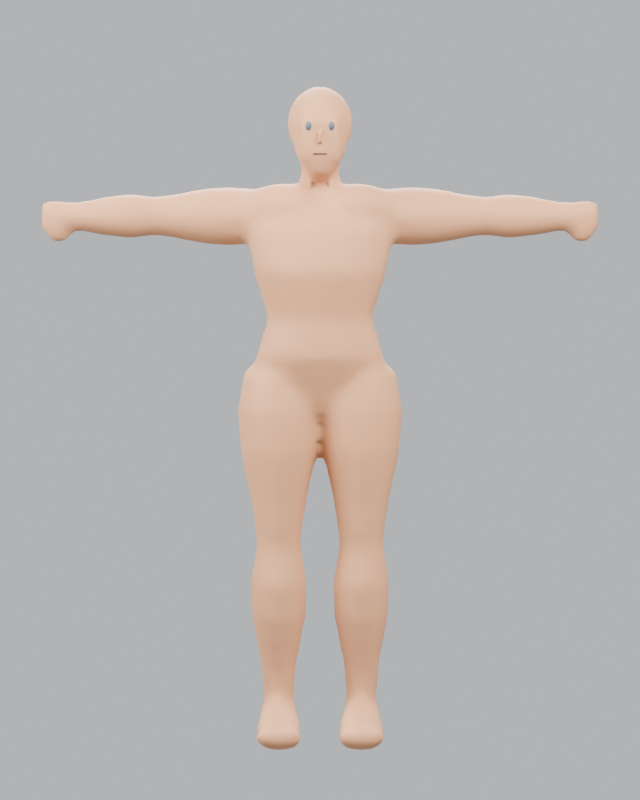
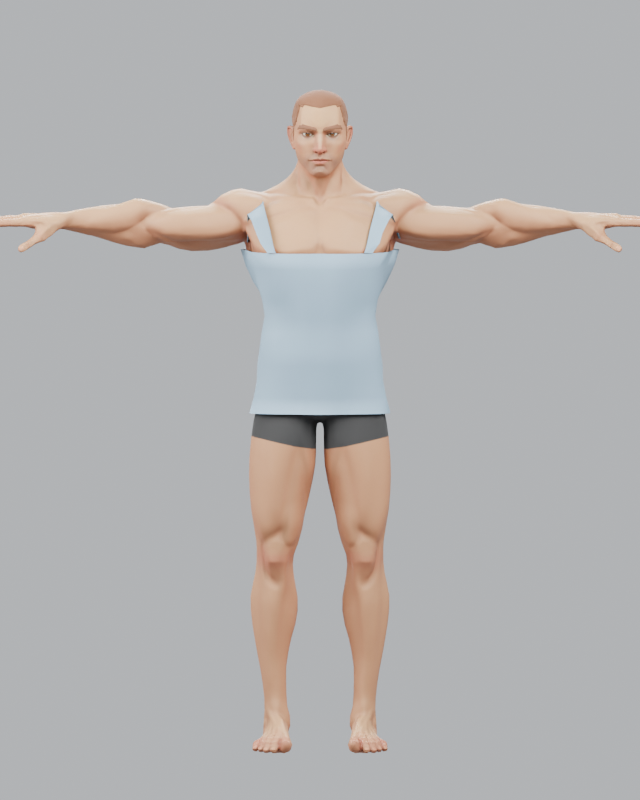
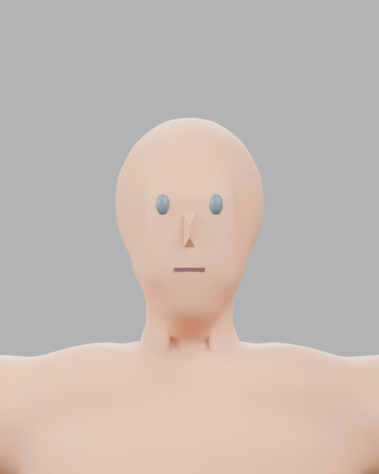
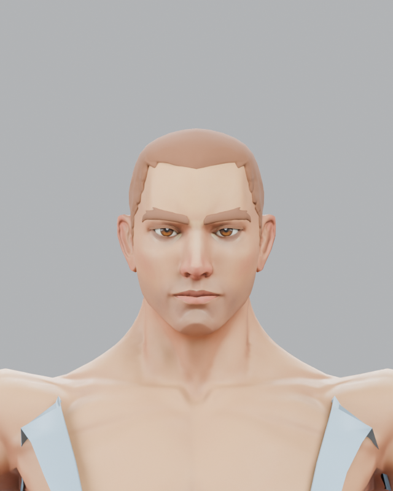
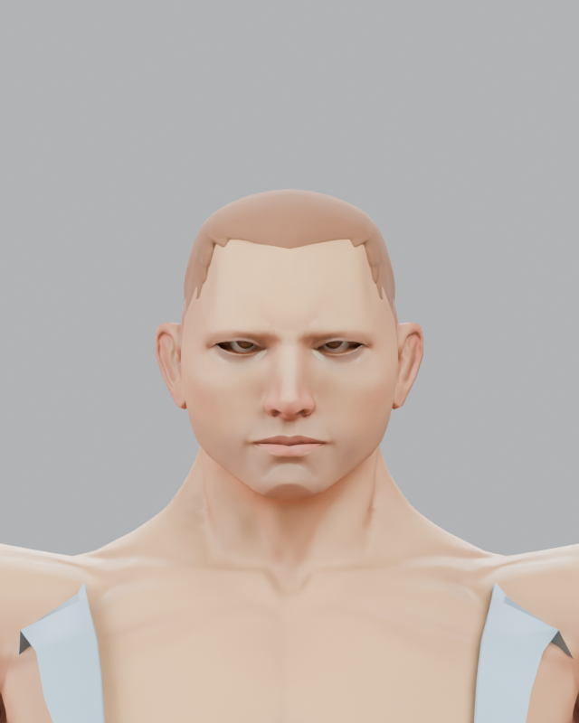

# Authored Human Proof-of-Architecture Prototype

Investigation: 5 October 2026. The experimental source is in
`tools/blender-character/authored_human_prototype.py`; its isolated recipe is
`tools/blender-character/recipes/authored-human-prototype-v1.recipe.json`.
Review renders are under `docs/assets/authored-human-prototype/`. The legacy
procedural compiler, recipes, fixtures and runtime were not changed.

## 1. Executive Result

**FAIL / PARTIAL** for this prototype. The authored Quaternius base is
immediately more recognisably human than the procedural mannequin, including at
conversation distance. It retains the exported Golden rig and loads in Three.js.
The six provisional morphs and the vest fail visual acceptance: jaw/nose changes
bury separate eyes, brows or the fitted hair, and the garment reads as an open
tube with shoulder strips. Body targets are deterministic but the athletic
extreme is exaggerated. The requested stop condition was reached, so no Studio
compile endpoint, finalisation route or registry entry was added.

This is a failed *implementation proof*, not evidence that authored topology is
the wrong direction. It demonstrates exactly which authored corrections are
missing from a code-only adaptation of this base.

## 2. Source Asset

- Origin: Quaternius, **Universal Base Characters**, Standard FREE pack,
  `Superhero_Male_FullBody.gltf` plus its external buffer and textures. The
  checked-in pack contains `License_Standard.txt`, which declares CC0 1.0.
  [Quaternius identifies this pack as CC0](https://quaternius.com/packs/universalbasecharacters.html);
  [CC0 permits copying, modification and commercial distribution](https://creativecommons.org/publicdomain/zero/1.0/).
  This covers the base and derived GLB use contemplated here. The checked-in
  Standard pack has no precise release number; hashes pin the exact snapshot.
- glTF SHA-256:
  `e7fcea214ecf8855afbf910b50de6f9c7d1decfb71ca28bad8a4481452dafeb4`;
  buffer SHA-256:
  `459003f9745853ae562a85506a2b94dd56515c1f37728f9fa3d2ce1a3e4cd92f`;
  bundled licence SHA-256:
  `0f4beaf0fe360a7732e58bbe3dbf60a2422367fbea60cb9ea4add968f383268e`.
- Source glTF: 8,483 vertices, 14,318 triangles across body, eyes and brows;
  body mesh 7,281 vertices / 12,566 triangles. All three source mesh primitives
  have UVs and skin weights. The source has seven texture references, a 65 joint
  rig with 65 body vertex groups, no morph targets and no animation clips.
- The source is editable as glTF/FBX, but the Standard pack does not include the
  vendor's `.blend` sculpt. The experimental shape keys are constructed during
  the Blender probe and baked before export. They are **not** a reviewed set of
  artist-sculpted targets.
- Existing Buzzed hair comes from the same checked-in CC0 Quaternius pack;
  source glTF SHA-256:
  `6e709c691d4feccda9788df917bf9604e751f02da21cee2bc81bcc3d26b3b580`.

## 3. Golden Rig Compatibility

The source is already on the Golden 65 joint rig. The probe retains all bone
names and parent-joint relationships and transfers existing artist-authored
source weights instead of using the procedural mannequin's analytic weights.
The exported joint order matches the current procedural GLB's exported order;
the largest corresponding rest-component difference is `3.58e-7`. The root's
non-joint parent object has a different name (`Armature` versus
`ProceduralMannequinArmature`). All five exported meshes are skinned to one
65 joint skin. The exported skeleton was not weakened to pass a validator.

The vendor glTF's original joint array has a different ordering from Blender's
re-export. This prototype therefore demonstrates compatibility with the
**existing compiled Golden output**, not byte-for-byte preservation of the
vendor glTF's skin ordering. No inverse-bind regression was found in the Three
load and clone check; a full compiled-family bind-matrix gate remains unwritten.

## 4. Body Morphs

Three fixed-topology shape keys were evaluated and then baked into GLBs:

| Target | Intended change | Visual result |
| --- | --- | --- |
| Mass | Abdomen, torso, thighs and upper arms expand by region | Fuller shape reads, but largely hidden by the vest; no obvious collapse in front view. |
| Muscle | Chest, deltoid, biceps and thigh volume | Distinct, but upper arms become bulbous at value 1. |
| Shoulders | Bounded upper-frame width | Visible; fixed rig limits how far this can safely go. |

All seven neutral/variant builds retained the same 7,281-vertex source body and
16,692-triangle dressed export. A combined case used mass `0.7`, muscle `0.45`
and shoulders `0.7`. Front views remained connected, but these scripted targets
were not accepted as anatomically finished sculpted morphs. No limb-length
targets were added. Height is represented by uniform armature scale in the
experimental recipe; only the default height was rendered.

## 5. Face Morphs

The body mesh contains integrated nose, lips, eyelids and ears. Three
fixed-topology targets were baked: head width, jaw/chin and nose projection.
Head width gives a modest plausible silhouette difference at value 1. Jaw and
nose fail the close-up test. The source's separate eyes and brows do not follow
the body-only deltas, and the fitted cap can become buried. The combined case
shows narrowed/dark eye openings, disconnected brows and a broken hairline.
It does not deliver plausible identity variation, despite valid vertex counts.

The underlying source face has usable human topology; the failed part is the
unreviewed target sculpt and missing matched targets for eyes, brows and hair.
These results must not be treated as approved face presets.

## 6. Hair Fit

The existing Quaternius Buzzed cap aligns reasonably on the neutral source
head. The probe binds it to `Head` on the main skin, scales it for the head-width
target and keeps its normal map. A plain colour factor was needed because the
source hair colour texture is pale. Neutral front/side hairline is readable.
The jaw/nose and combined cases visibly expose scalp or lose the intended
hairline. Thus one hairstyle was *attached*, but robust morph-aware fitting was
not proved. No other styles were attempted.

## 7. Garment Fit

The internal vest coupon samples a fixed torso surface cage, receives the same
three body morph values, copies nearby authored bone weights, and has a two-shell
wall with 6 mm thickness and about 12 mm inner clearance at rest. It has its
own cloth material. It remains smooth through the fuller and combined front
views, which is better than the first direct face-cut attempt (jagged boundaries).

It still fails as clothing: the tube-like chest opening and separate shoulder
bridges look like an unfinished apron, with visible gaps near the shoulders.
Neutral appearance already fails, so idle/walk/raised-arm garment acceptance
was stopped. There is no body coverage mask. This coupon proves a deterministic
surface-transfer mechanism, not a usable fitted vest.

## 8. Materials

The source body retains UVs and its base-colour, normal and roughness images;
eyes retain their image. The source glTF contains two stale normal-map URI
spellings; the importer resolves them in memory without editing vendor files.
Hair/brows use a solid tinted base with the hair normal map. The garment has an
opaque blue-grey rough cloth material and no UVs or cloth texture. The output
contains five materials, five embedded images and five mesh primitives.
These choices suffice to reveal anatomy, but colour, hair and garment art are
not product quality.

## 9. Pipeline Integration

What was actually exercised:

`isolated versioned recipe → Blender experimental script → baked skinned GLB
→ Blender re-import/render → Three.js GLTFLoader parse + skeleton clone`.

The existing Golden idle/walk clips parse against the exported node names.
Studio's compile request routing, one-build preview policy, two-build full
finalisation, manifests/provenance publication, checked-in asset registry and
in-game visual assignment were **not** connected. The visual stop condition
was reached before that work. This does not prove that the complete pipeline
survives, and no final artifact was published to `public/assets/derived/`.
Experimental GLBs and extra renders remain only in ignored `test-results/`.

## 10. Visual Comparison

The same Blender camera presets and neutral lighting were used for the checked-in
legacy mannequin and the prototype. The legacy has mitt hands, simple volumes
and separate eye/nose/mouth primitives. The authored base has fingers, ears,
lips, eyelids, defined muscles and a substantially more credible face. An
uninformed viewer would see a clear human-quality jump in the *base*.

| Legacy procedural | Authored neutral |
| --- | --- |
|  |  |
|  |  |

The combined face loses coherence; the improvement does not survive the requested
identity variation:

The fixed cameras also produced local side, three-quarter and back neutral
views and focused body/face variants under
`test-results/authored-human-prototype/`. Those ignored files are local review
evidence, not committed acceptance fixtures. The garment and hair are plainly
weaker than the source body in the images above.

## 11. Animation / Deformation

Three.js loaded the Golden idle and walk clips (23 tracks each) with zero
missing node targets. A sampled half-time pose had finite bone matrices, and
two cloned instances had independent bones. This is structural compatibility.
Rendered idle, walk, raised/reaching arm, bent elbow, deep hip/knee bend and
head turn were **not** accepted or captured after the visual failure. Shoulder,
elbow, hip/knee, neck and garment deformation therefore remain unproven.

## 12. Runtime / Asset Cost

| Measurement | Observed result |
| --- | ---: |
| Editable vendor body | 7,281 vertices; 12,566 triangles |
| Source total | 8,483 vertices; 14,318 triangles |
| Exported body / vest / dressed total | 12,566 / 1,544 / 16,692 triangles |
| Output | 5 skinned mesh primitives, 5 materials, 5 embedded images |
| Neutral GLB | 14,037,864 bytes (13.39 MiB) |
| Legacy bare mannequin GLB | 440,264 bytes (0.42 MiB) |
| Embedded image payloads | 4,326,126 + 4,252,937 + 1,384,380 + 3,152,049 + 35,958 bytes |
| Blender neutral build | 1,206 ms internal report; one observed wall run 3.33 s including startup |
| Other morph builds | 1,157–1,573 ms internal reports |
| Three.js parse | 57 ms in local Node, with stub image decoding; not browser texture upload time |
| Full two-build compile | Not run; no full compiler path exists for this failed family |

The size is dominated by source PBR images. No optimisation or LOD work was
attempted. Node parse time is not a gameplay load benchmark.

## 13. Validation Results

- Eight targeted Blender GLBs (neutral, six single targets, one combined)
  exported. Neutral and combined both have one 65-joint skin, five meshes,
  16,692 triangles and no exported morph targets, as intended for baked identity.
- Blender re-imported and rendered the exported neutral and comparison cases.
  Three.js `GLTFLoader` parsed neutral in Node: five skinned meshes, four UV
  primitives, no skin-weight sum errors above `0.001`; `SkeletonUtils` clones
  have independent bones. Idle/walk clip target and finite-transform checks
  passed. This is a real GLB parse round trip, but not full authored-family
  validation or visual animation acceptance.
- New recipe/rig/UV/garment automated contract suites, two-build determinism,
  Studio browser preview and root runtime browser checks were not run or built
  after the visual stop condition. Legacy procedural implementation was not
  modified.
- Final `npm.cmd run ci`: **passed once** — 76 Vitest files / 623 tests,
  root/Studio builds, all three package builds and 50 Node compiler/asset
  tests. Final `git diff --check`: **passed**.

## 14. Problems Discovered

1. The source's eyes and brows are separate meshes. Body-only face shape keys
   cannot preserve their position, eyelid clearance or brow attachment.
2. A tight short hair cap cannot be adapted by width scaling alone; local scalp
   and hairline deltas require matched targets or a reviewed fit cage.
3. Canonical torso sampling gives deterministic vest correspondence, yet the
   garment needs deliberately authored neckline, armholes and shoulder joins.
4. The muscle target over-inflates arms at its endpoint. Sculpted targets and
   anatomical review are required even on a strong base mesh.
5. The source's large textures make the dressed prototype about 32 times the
   byte size of the bare procedural fixture. This is a measurement, not a
   rejection by itself.
6. The Standard source has no supplied `.blend` morph source; its existing
   glTF/FBX is editable, but a durable sculpted base package remains to be made.

## 15. Architecture Verdict

**NO**: do not commit the product to the authored-first hybrid implementation
on this evidence. The base-human visual advantage and Golden/Three compatibility
are real, but the essential face, hair and clothing combination failed, and
animation/finalisation remain unproved. This does not justify returning to
primitive-volume anatomy; it identifies the art/fit work that the architecture
decision assumed would be authored.

## 16. What We Build Next

The smallest next experiment is an artist-reviewed source package on this same
licensed base and Golden rig: sculpt the six corresponding body/face targets
*with matched eyes, brows and scalp/hair changes*, and model one genuine vest
with neckline, armholes, shoulder seams and morph-specific ease corrections.
Review neutral, combined and raised-arm images before adding any Studio UI or
compiler routing. If those pass, reconnect the existing preview/full pipeline
and run the requested browser/runtime acceptance. That next experiment was not
started here.
