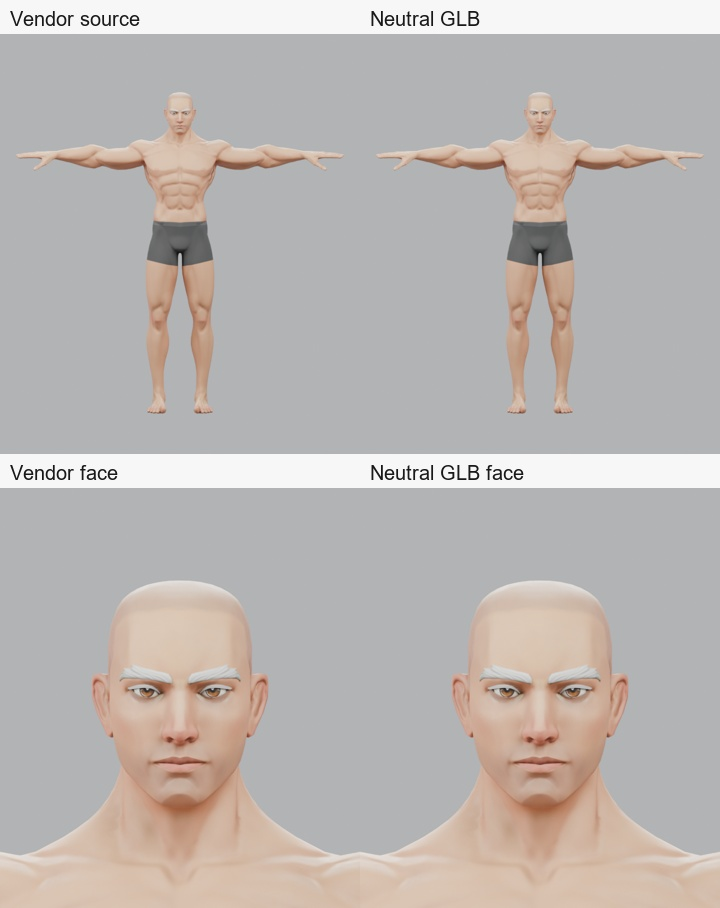
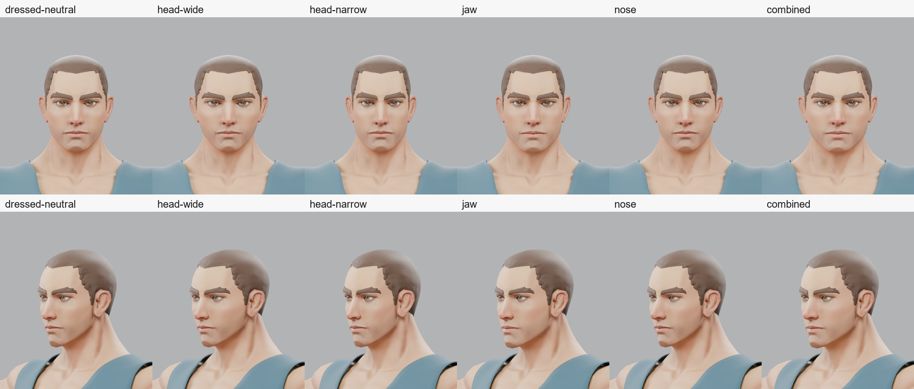
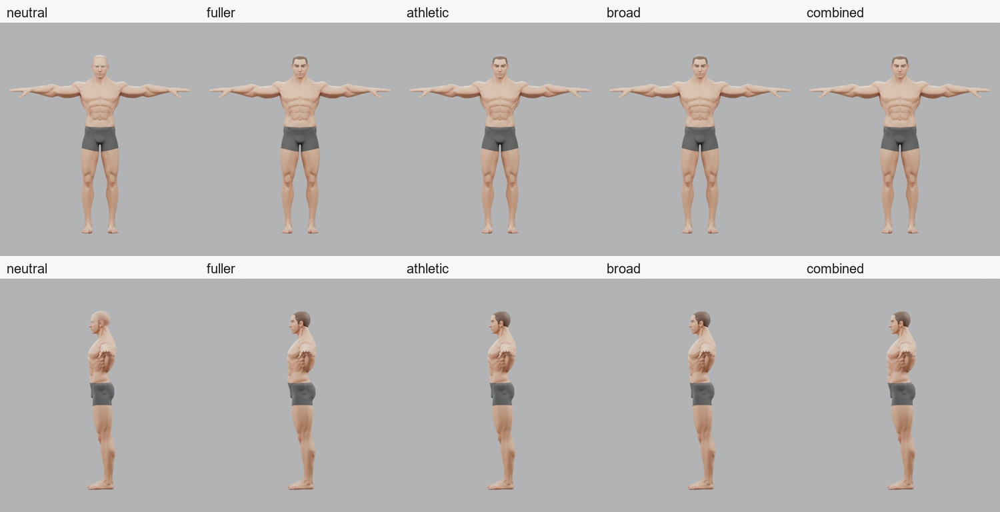
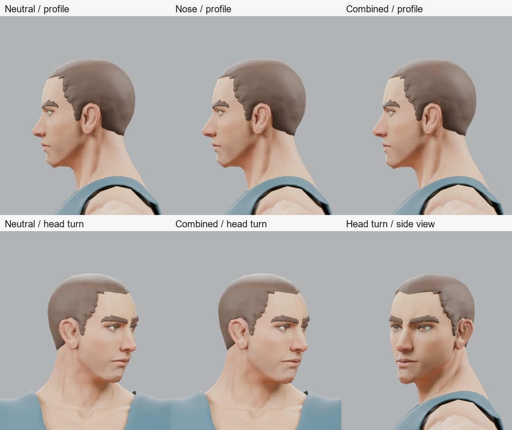
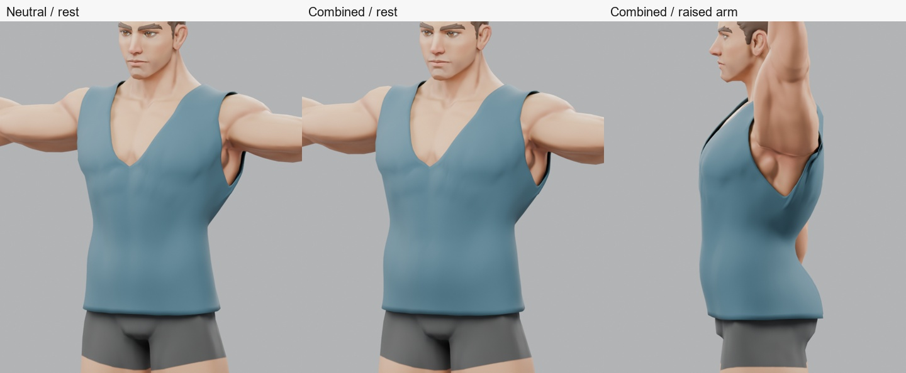
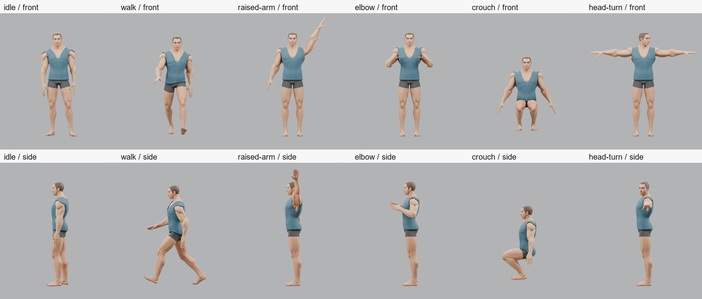
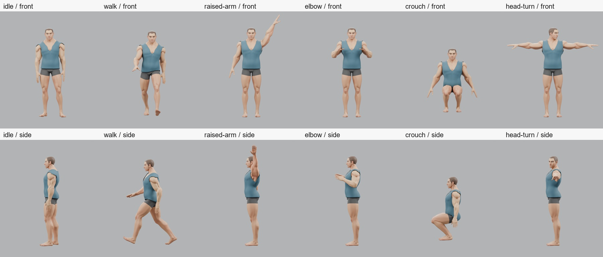
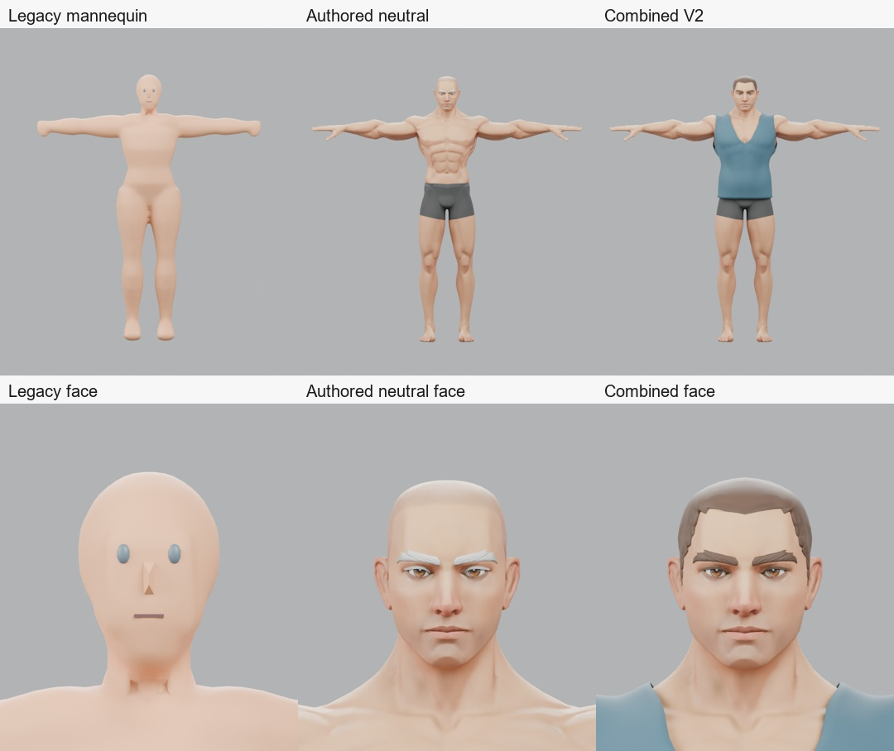

# Authored Human Prototype — Second Pass

Investigation and fresh rendering: 6 October 2026, Blender 5.2.0 LTS.
Source package: [experimental/authored-human-v2](tools/blender-character/experimental/authored-human-v2/README.md).
Reproduction inputs and exact selections are documented there. This report ends
the experiment; no creator migration or product integration was undertaken.

## 1. Executive Result

**PARTIAL — visual acceptance FAIL.** The neutral authored source is preserved.
The new face variants keep eyes, brows and short hair together, and the connected
tank is recognisable clothing in rest pose. The combined identity retains the
base's human character instead of reproducing the first pass's buried eyes and
broken hairline. However, the garment still penetrates at the back/armhole under
motion, and the stress poses expose stretched shoulder, elbow and knee regions.
The body variations are conservative refinements of an already muscular man,
not a convincing broad library of body types.

The requested complete result—especially a genuinely wearable garment through
the deformation set—has **not** passed. The candidate is preserved for review,
with its failures. A successful GLB load is not being substituted for this gate.

## 2. Neutral Base

The existing `Superhero_Male_FullBody` is imported without editing its geometry,
UVs, weights, rest rig or source materials. It retains 7,281 body vertices and
12,566 body triangles; eyes and brows remain separate meshes. No legacy mannequin
geometry is used. `canonical-neutral.blend` packs the images and keeps the
65-joint rig. `candidate.blend` separately holds the editable experiment.

The importer resolves `T_Hair_1_Normal_png.png` and `T_Eye_Normal_png.png` to the
existing correctly named files in memory. The vendor bytes are unchanged.
The glTF hash remains `e7fcea214ecf8855afbf910b50de6f9c7d1decfb71ca28bad8a4481452dafeb4`;
the buffer hash remains `459003f9745853ae562a85506a2b94dd56515c1f37728f9fa3d2ce1a3e4cd92f`.
Every consumed mesh, buffer, texture and bundled licence is pinned in
`vendor-hashes.json`, with a before/after immutability check during generation.

Direct vendor-import and re-imported neutral-GLB renders use the same cameras,
24-sample Cycles lighting and AgX transform. Their mean absolute RGB differences
are **0.00044/255** for the full front view and **0.00113/255** for the face.
Visual inspection finds no meaningful quality loss. The source's pale brows
are retained in the canonical comparison; only the dressed candidate tints
brows and hair brown while preserving their normal maps.

## 3. Face Targets

These are curated, programmatically authored landmark targets, **not a manual
artist sculpt or vendor-supplied morph library**. Named surface landmarks have
explicit displacement vectors and stationary controls. Compact interpolation
fills the gaps while preserving the source topology. There is no normal-based
inflation, coordinate-band scaling or legacy geometry blending. The resulting
shape keys were judged from actual front, three-quarter and selected profile
renders, rather than accepted from the interpolation alone.

| Target | Head/body change | Eyes, brows and hair | Visual result |
| --- | --- | --- | --- |
| Head width | Temple/parietal breadth and attached ear roots; cheek adjustment; neck, chin and nose controls held. Broad and narrow endpoints tested. Maximum body-vertex displacement 6.04 mm. | Socket controls translate 1.5 mm per side at the broad endpoint, reversed at narrow. Each eye translates rigidly. Brows and hair receive matched canonical-surface deltas. | Recognisable wider/narrower head without the first pass's broken brow/hair relationship. Modest identity range. |
| Jaw / chin | Chin projects/lowers slightly, mandible angle and body broaden together, with a smaller lower-lip/corner transition. Maximum 4.82 mm. | Eye sockets, upper-lip and ear landmarks are pinned. All attachments still have matched keys; small residual local movement follows the surface. | Lower-face difference remains coherent; lips stay closed, ears attached, eyes readable. It remains recognisably the same base identity. |
| Nose | Tip, bridge, alar wings and columella move as a connected feature; philtrum transition is smaller and nasolabial/lip/socket controls constrain the surroundings. Maximum 2.96 mm on the actual source vertices. | Eye sockets are pinned, rigid eyes follow their socket field, brows/hair use the same correspondence path. | Plausible but subtle projection/width change; no buried eyes or detached nasal primitive. This is not a large nose-shape range. |

The eye meshes retain their internal shape. Eyelid/eye coherence is visually
reviewed, not a certified numerical clearance envelope over every interpolated
value. Exact socket controls are covered by a deterministic constraint test.

## 4. Body Targets

Joint-centre handles remain fixed; no rest bone, joint length or inverse bind
is changed. Each target is a set of directional anatomical handles, with
interpolation between them. The source's authored weights are retained.

| Target | Implementation | Experimental range / acceptance | Actual visual result |
| --- | --- | --- | --- |
| Mass / fuller | Forward abdomen/lower abdomen, lateral obliques/hips, back/seat depth, thigh front/side/back, upper-arm underside/front/back and small neck changes. Maximum 23.70 mm. | 0–1 authored; endpoints and all-ones combined tested. **No production-approved range.** | Fuller waist/abdomen and limbs remain connected. The source's strongly defined muscular surface/texture remains, so this is a fuller muscular man, not an accepted heavy-body archetype. |
| Athletic | Pectoral and upper chest, restrained deltoid, biceps/triceps, latissimus, quadriceps/hamstring handles. Maximum 6.80 mm. | 0–1 authored; same limited evidence. | Restrained enhancement; no balloon biceps. The base is already very muscular, so differentiation is weak at gameplay framing. |
| Broad frame | Ribcage/scapular/pectoral breadth with small outer-deltoid and clavicle-surface changes; waist/sternum/neck constrained. Maximum 9.19 mm. | 0–1 authored; deliberately small because the rig is fixed. | Wider upper body without moving the actual articulation centres. This is bounded breadth, not a new skeletal frame. |

All six positive endpoints together form the hardest tested combination. Narrow
head is also rendered separately. Intermediate values and all possible mixtures
are **not** an accepted continuous envelope. Front/side body comparisons hide
the tank so it cannot conceal anatomical defects.

## 5. Hair Fit

Only the existing Quaternius **Buzzed** style is used. Its vendor mesh is imported
without general width scaling, attached to `Head`, and bound once to canonical
head triangles. Barycentric interpolation of the actual head deltas produces
matched keys on the cap; brow vertices use the same mechanism. This preserves
the neutral hairline and transfers local scalp change instead of moving a
static accessory around a changed skull. Identity is baked before GLB export.

Front, three-quarter, side, rear and head-turn evidence retain the cap's seating
at the tested identities; no first-pass scalp exposure or detached brows were
seen. The cap remains a simple solid style. No all-surface numerical hair/lid
clearance certification or other hairstyle adaptation is claimed.

## 6. Garment

The tank is a new connected pattern: a shaped front neckline, higher back neck,
two armhole cutouts, shoulder panels sharing the torso's edge vertices, an eased
waist-length hem, UVs and **2.5 mm** solid thickness. It is not the previous
open horizontal tube with disconnected shoulder strips. Cloth smoothing and
subdivision precede fixed triangulation and identity keys.

The initial render exposed chest poke-through after smoothing. Canonical vertex
and face-centre clearance correction removed that visible defect while keeping
the neckline/armholes. The corrected neutral garment was reviewed before the
motion tests. Correspondence is then stored once against canonical body
triangles; every body target drives matched garment keys. Skin weights are
barycentrically transferred, normalized and limited to four influences.
There is no per-identity generic shrinkwrap, body mask or pose-specific rescue.

Rest fit is materially improved and reads as clothing. **Animated fit fails**:
the raised-arm side view exposes skin through the back below the armhole, and
the armhole/back fabric bunches and stretches. The rest clearance correction
does not solve weight gradients during motion. It is not a finished wearable
asset and should not enter the product wardrobe.

The final exported rest-pose sample has minimum signed gaps of **+4.02 mm**
neutral and **+4.27 mm** combined, with no sampled penetration beyond 1 mm.
The motion failures therefore cannot be dismissed as the already-corrected
neutral chest defect.

## 7. Animation / Deformation

Neutral and all-ones combined GLBs were each re-imported and rendered in all six
requested motion/diagnostic poses, front and side. Idle/walk use the current
Golden clips at approximately 25% of their duration. Four other poses are
explicit diagnostics, not newly authored production clips: an upper-arm raise
60 degrees above the source T pose; 115-degree elbow bend; 85-degree hip and
125-degree knee flexion; and a 15-degree neck plus 40-degree head turn.
The raise does not add clavicle rotation; it is a demanding local shoulder
test, not proof that the Golden hierarchy inherently cannot perform an overhead
reach. Existing source weights and the pose construction both affect the result.

| Pose | Render observation | Neutral / combined minimum signed garment gap |
| --- | --- | ---: |
| Idle | Human stance and intact hands/face; shoulder-cap/armhole bunching. Numerical local penetration prevents a clothing pass. | −14.18 / −15.40 mm |
| Walk | Readable stride; no detached limbs. Torso/armhole clearance is not maintained. | −11.47 / −13.66 mm |
| Raised arm | Visible back poke-through and armhole strain; shoulder/armpit shape needs review. **Fail.** | −10.59 / −13.68 mm |
| Elbow bend | Hands/wrists remain attached, but compressed inner-elbow and stretched surface regions are not accepted deformation quality. | −9.23 / −10.80 mm |
| Deep hip/knee bend | Thighs/groin stay connected; compressed/angular knees and local garment penetration remain. Diagnostic root lowering is not a grounded locomotion clip. | −13.16 / −13.90 mm |
| Head turn | Eyes/brows/hair remain seated; no obvious neckline collision at the sampled pose. | +4.52 / +4.36 mm |

Gap values sample garment vertices and triangle centres against the posed body
(26,684 samples), including inner cloth surfaces. Signed nearest-surface gaps
are diagnostic samples, not an exact collision-volume proof. The visible raised
arm defect corroborates the negative values. Maximum body edge stretch reaches
5.32× neutral / 5.57× combined in the deep bend; maximum combined garment stretch
is 4.97× in sampled walking. These failures are retained, not turned into relaxed
pass thresholds. A transport check only requiring finite positions is explicitly
separate from this deformation verdict.

## 8. Visual Comparison

The legacy mannequin still reads as simplified primitive anatomy with mitt hands
and separate facial pieces. The authored neutral is plainly more human: fingers,
ears, integrated lips/lids, defined face and body anatomy. The combined V2 keeps
that advantage at rest, now with a coherent face/hair package and an actual tank
silhouette. Its identity changes do **not** establish a clearly superior sculpt
to the neutral source; they are restrained alternatives. The clothed result
loses acceptance under stress. Therefore the full target is not met merely
because its rest image is better than the legacy mannequin.

All comparisons are actual Blender renders. No generated illustration or
retouched model imagery is used. Contact sheets only resize and label renders.

## 9. Pipeline Compatibility

- **Golden rig:** one 65-joint skin on all five dressed mesh primitives; names,
  parent relationships, rest transforms and inverse binds checked. Maximum local
  rest-component difference from the existing compiled Golden/legacy output is
  `3.58e-7`.
- **Clips:** current Idle and Walk each resolve all 23 tracks. Five time samples
  per clip and identity produce finite skinned vertices and actual pose changes.
  This is transport compatibility, not a deformation-quality pass.
- **GLB loader:** nine fresh dressed identities parse with Three `GLTFLoader`.
  Every mesh has UVs and normalized, at-most-four skin weights; maximum observed
  weight-sum error is below `0.000001`. Identity keys are baked, not exported.
- **Clone path:** the actual shared `cloneThreeVisualAssetRoot` function was
  exercised. Clones have separate bones; animating one leaves the other unchanged,
  and rest restoration succeeds.
- **Topology:** fixed source-vertex IDs and per-corner triangle/UV comparison
  verify identical canonical domains across the nine identities. glTF's split
  normals can duplicate a body export vertex (7,281 versus 7,282); this is recorded
  separately from destructive source-topology changes. Garment triangles are
  fixed before morphing, avoiding identity-dependent diagonal choices.
- **Cost:** each dressed GLB is approximately 14.65 MB, five primitives and
  32,940 triangles. No texture optimisation, LOD or runtime performance claim.

The Node check stubs image decoding; the Blender round trips render the real
embedded images. A browser/WebGL preview, Studio preview/full dispatch, two-build
determinism, finalisation/publication and gameplay assignment were **not** added
or validated for this family because visual acceptance failed first. Existing
production validators and legacy assets were not changed to admit the candidate.

Validation: three focused sculpt-constraint tests passed; the isolated nine-case
GLB/rig/clip/clone checks passed. **`npm.cmd run ci` passed once**: 76 Vitest files /
623 tests, root and Studio builds, all three package typechecks/builds, and
50 Node compiler/asset tests. Existing build chunk-size advisories remain.
**`git diff --check` passed**; new, untracked text files were also separately
checked for whitespace, report sections and valid local links. The CI log is
`test-results/authored-human-v2/ci.log`. These checks preserve the existing
product; they do not reverse the new candidate's visual failure.

Reopening the saved sources caught Blender's newly added keys defaulting to one.
The bootstrap now explicitly saves them at zero. Both preserved `.blend` files
were reopened successfully afterward: seven packed images in canonical neutral,
nine in the candidate, the 7,281-vertex body and 65-joint rig intact, and all six
candidate identity keys zero on all five meshes. A targeted rebuild produced
**byte-identical hashes for all ten GLBs**, so the reviewed geometry and images
were unchanged by this source-default fix. Full CI was not unnecessarily repeated.

## 10. Remaining Problems

1. The tank is not safe through motion. Canonical fit plus interpolated weights
   is insufficient around its armhole/back; numerical and visible evidence agree.
2. Shoulder/elbow/knee deformation has not earned acceptance. Source weights,
   garment weights and realistic pose construction need separate diagnosis before
   blaming or replacing the fixed Golden rig.
3. Body targets are intentionally small. Fuller retains the source's strongly
   muscular detail; athletic/broad differences are subtle. This is not an
   artist-approved archetype library.
4. Face/hair coherence is supported at the sampled endpoints, not a complete
   continuous clearance guarantee or an expression/animation system.
5. The tank has plain material, simple UVs, a conspicuous centre-back crease and
   no deliberate coverage mask. Its 17,792 triangles are unoptimised prototype
   geometry; runtime cost has not been benchmarked.
6. The editable source is preserved, but no production compiler contract,
   durable character library, public sliders or migration exists for it.

## 11. Verdict

**NO — not yet enough evidence to commit the future creator to this completed
geometry-and-clothing family.**

The authored base remains a substantially better foundation than the legacy
mannequin, and V2 repairs the conspicuous first-pass attachment failures.
It has not passed the requested wearable-garment/deformation gate. This result
does not establish that Quaternius cannot support good morphs or that Golden is
intrinsically unsuitable. It does establish that the current candidate must not
be promoted on rest-pose appearance or structural checks alone.

## 12. Next Step

The smallest next visual experiment is **one local garment-weight and armhole/back
fit correction on this preserved neutral and combined pair**, with a reviewed
clavicle-assisted raise. Re-render those two identities in rest, idle, raised-arm
and deep bend, exposing the same back/armhole areas. Keep the neutral body and
face targets fixed so the outcome is attributable to that correction. If source
body articulation still fails, inspect the shoulder/knee weights locally before
considering a new rig profile.

Do not expand morph ranges, add more garments or integrate the creator until
that small experiment passes. It was not started after this report.
