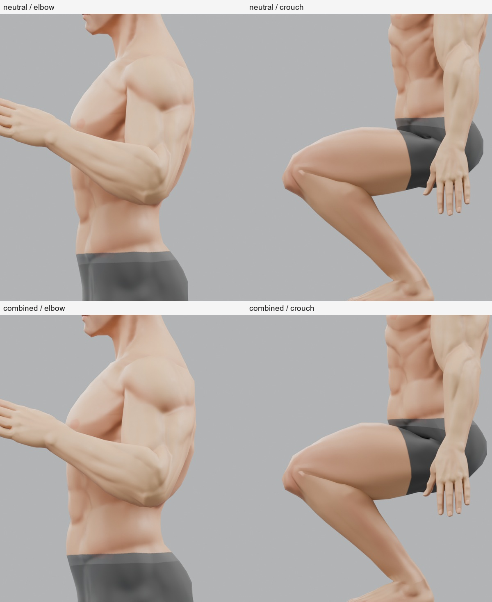
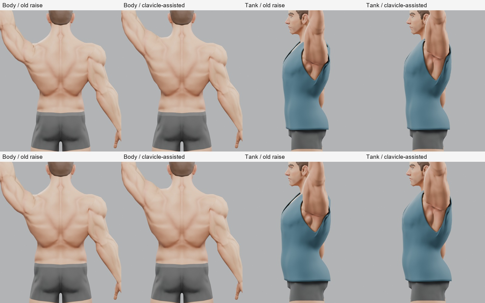
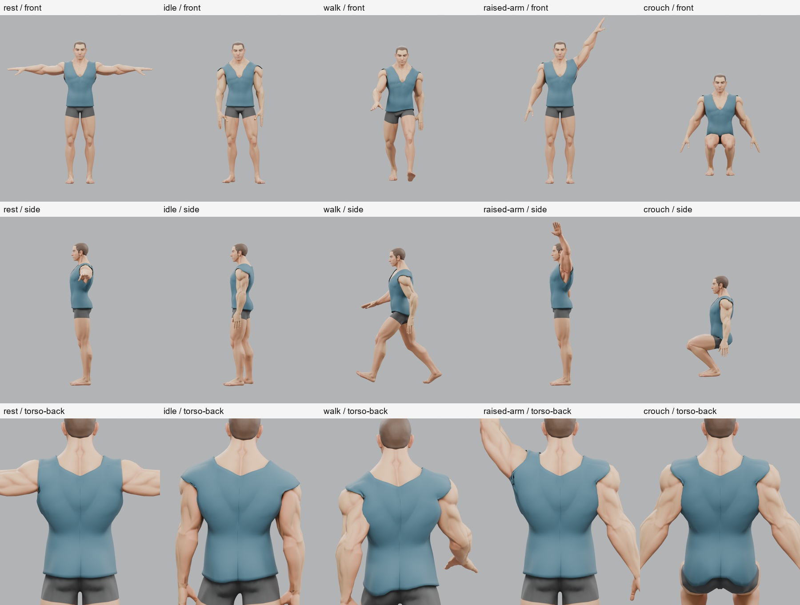
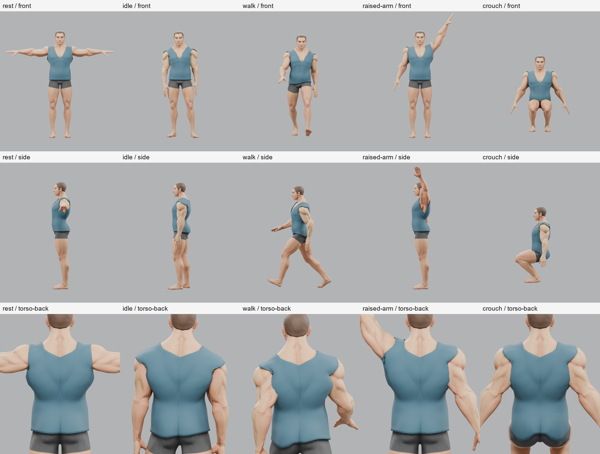
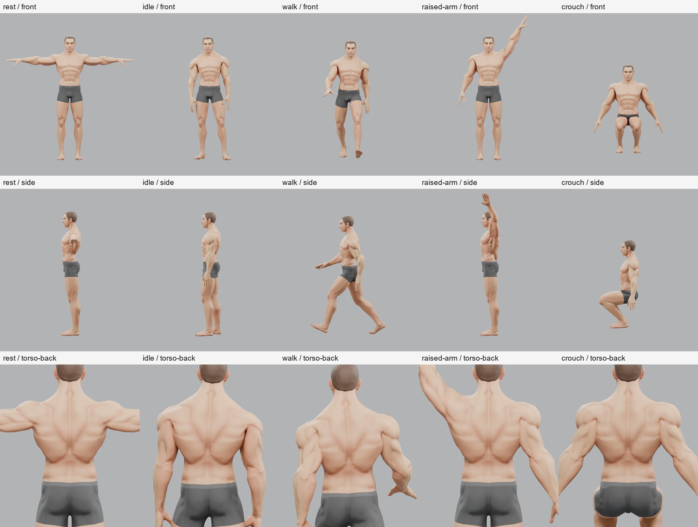
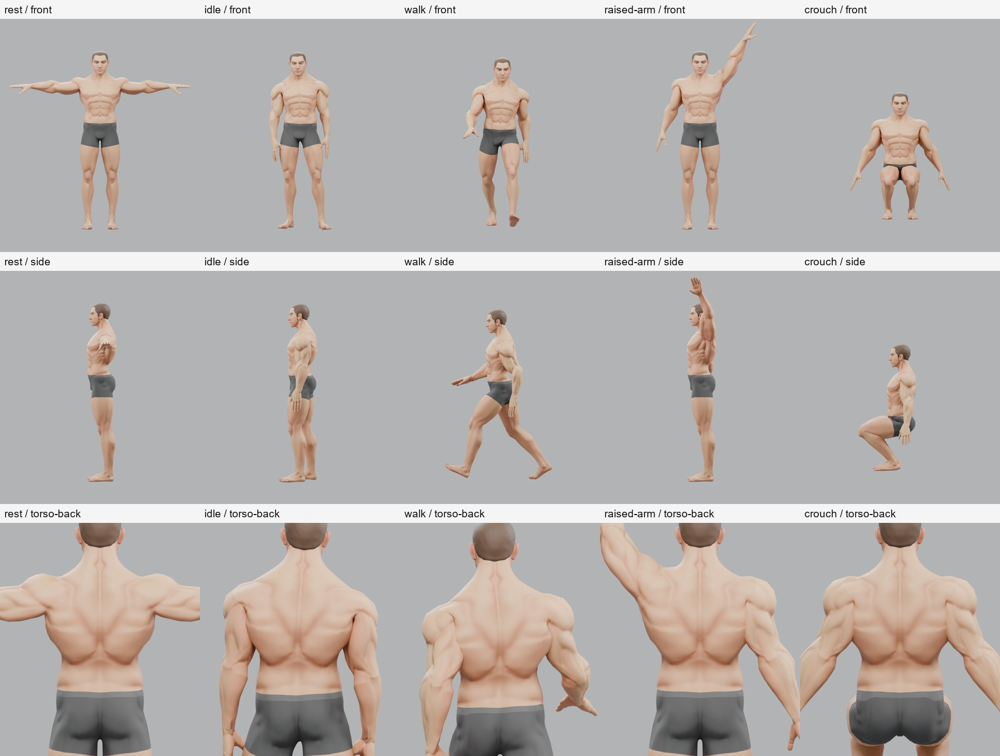

# Authored Human V3 — Deformation and Garment Gate

Investigation: 6 October 2026. Blender 5.2.0 LTS, build `fbe6228777e7`.
Baseline: [V2 result](AUTHORED_HUMAN_PROTOTYPE_V2_RESULT.md) and its preserved
[candidate package](tools/blender-character/experimental/authored-human-v2/README.md).
[Reproduction and evidence](tools/blender-character/experimental/authored-human-v3/README.md).

## 1. Executive Verdict

**FAIL — the body-deformation stop condition is reached.** The unclothed body
has unacceptable local elbow and deep-knee deformation in both requested
identities. The tank also still fails the realistic raised-arm view: the back
below the armhole penetrates and the armhole wall bunches. The current pair
cannot be approved as a wearable character family.

This is a diagnosis and an explicit stop, **not a failed trial of garment weight
correction**. Phase 1 and the Phase 2 comparison were completed. Existing garment
weights were inspected, but Phases 3–5 were not applied after the body failed.
Consequently, this experiment does not prove that local garment corrections
cannot work, or that Golden joint placement is incompatible. It establishes
that fixing only the tank would not satisfy the requested body-and-garment gate.

The entire freshly exported neutral and combined dressed GLBs are byte-identical
to V2. The neutral body, six identity targets and their values, source materials,
Buzzed hair, garment geometry/weights, and 65-joint rig are unchanged. All V2
package files were hashed before and after export and remained unchanged.
No Studio integration, additional morphs/garments, rig changes, corrective poses,
cloth physics or body masks were introduced.

## 2. Body Deformation Diagnosis

The tank was hidden for this inspection; the source body's painted shorts remain
part of its existing material. Front, side and close rear views were rendered
for neutral and combined. Close elbow and knee views make the stopping defects
visible without relying on cloth or numerical thresholds.

| Pose | Neutral body | Combined body |
| --- | --- | --- |
| Rest | Acceptable preserved source. Muscular, visibly faceted art, but no new collapse. | Acceptable relative to V2; same topology and intended all-ones identity. |
| Idle | Usable at whole-body framing; close lowered deltoid/armpit has an angular ledge and crease. Local shoulder limitation remains. | Same limitation, with slightly stronger shoulder compression. No detached limb. |
| Walk | Readable stride and connected anatomy; close rear shoulder ridge stretches and flattens. Marginal locally, not an unrestricted deformation pass. | Same finding; identity does not repair the transition. |
| Clavicle-assisted raised arm | Raised-side clavicle and shoulder move together; upper back stays connected. Adequate to diagnose clothing, with stretched armpit and lowered-side shoulder ridge still visible. | Same finding. Not a gross raised-shoulder collapse, but not a full shoulder-quality approval. |
| Elbow bend, diagnostic | **Fail locally:** angular, broad elbow bulge and pinched inner transition; the outer region loses a coherent rounded elbow profile. | **Fail locally:** the same defect, slightly more pronounced. |
| Deep hip/knee bend | **Fail locally:** flattened/angular kneecap and compressed inner knee. Groin/seat remain connected, but stretched/folded regions do not earn acceptance. | **Fail locally:** same knee defect and seat/groin compression. |

The body failures are present in the source weighting, not introduced by the
new export or by tank contact. A manual linear-skinning calculation reproduces
Blender's evaluated edge endpoints to within **0.00013 mm**. Representative
neutral edges have the following source-weight transitions:

| Region / pose | Actual rest edge → posed edge | Relevant weight transition |
| --- | --- | --- |
| Back shoulder / idle | 13.72 → 43.19 mm, 3.15× | Upper arm 0.222 → 0.513; clavicle 0.613 → 0.423. |
| Elbow / bend | 23.74 → 100.84 mm, 4.25× | Lower arm 0.768 → 0.122 across one edge. |
| Knee / deep bend | 25.10 → 73.78 mm, 2.94× | Calf 0.256 → 0.799 across one edge. |
| Groin / deep bend | 4.19 → 22.32 mm, 5.32× | Pelvis 0.571 → 0.777 and right thigh 0.412 → 0.203. |

A numeric counterfactual gives the two endpoints of each selected edge their
mean weight vector, keeping their coordinates, pose and all joint positions
fixed. Their stretch ratios become 0.825, 0.546, 0.568 and 0.831 respectively.
This isolates a substantial weight-gradient contribution; it is **not an
accepted correction**. Collapsing a gradient can exchange stretching for volume
loss. No body weights were saved or exported, and no whole-body smoothing was
performed. The detailed weights and endpoint calculations are retained in
[evidence.json](tools/blender-character/experimental/authored-human-v3/evidence.json).

Pose construction is also distinguished from source weighting. Idle and walk
use the existing Golden clips near 25% duration. Elbow and knee diagnostics
retain V2's 115° and 125° added flexion, with 85° hip flexion and 0.42 m pelvis
lowering. The bends are intentionally demanding; this is not a grounded squat
animation. Root lowering moves the body as a whole and does not account for
local edge stretching. Rest segment offsets mean the absolute segment angles
are slightly larger than the added flexion. These poses are not relaxed to
manufacture a pass.

**Cause assessment:** source weight gradients demonstrably contribute; missing
clavicle motion affects the old shoulder test; extreme flexion accentuates the
elbow/knee defects. Joint placement has not been proved to be the blocker.
Topology/volume preservation may also limit a repair; the two-vertex calculation
does not distinguish all of those art-quality factors. It would be unjustified
to claim that weights alone are guaranteed to solve the body.

## 3. Shoulder Raise

Both diagnostics remain available as `raised-arm-old` and `raised-arm`:

| Construction | Old | Clavicle-assisted |
| --- | --- | --- |
| Left clavicle elevation | 0° | 20° |
| Left upper arm above source T | 60° from the upper arm alone | 40° upper-arm rotation plus 20° clavicle rotation |
| Left elbow | Straight | 15° forward bend |
| Right arm | Original lowered control | Identical lowered control |
| Left upper-arm direction | Reference | 0.00° difference from old |
| Shoulder pivot travel from rest | 0 mm | 64.23 mm |

This is a simple clavicle-assisted diagnostic, not a clinical shoulder model or
a new production clip. It keeps the original humeral elevation instead of
reducing the reach. The rest hierarchy, bone axes and joint locations remain
untouched; the shoulder pivot moves through the existing clavicle parent.

Visually the assisted pose distributes movement through the clavicle and upper
back. It **does not rescue the tank**: back poke-through and a pinched armhole
remain in both identities. Global minimum signed clearance stays at −10.59 mm
neutral / −13.68 mm combined; that global statistic includes the unchanged
lowered side and must not be read as a raised-side-only result. Maximum garment
edge stretch rises from 4.19× to 6.02× neutral and 4.82× to 7.13× combined.
The assisted pose remains the acceptance pose even though these maxima worsen.

Top row neutral, bottom row combined. The first two columns compare the bare
back; the last two compare the tank from the raised-arm side.

## 4. Garment Weight Changes

**None applied because the preceding body gate failed.** Inspection of the
existing barycentric transfer identified a concrete local defect for later work.
The outer and inner tank surfaces are transferred independently after solidifying
in `build_tank`. At the back armhole, their weights differ despite being only
2.5 mm apart.

For source pair **1031 / 5477**, upper-arm influence is **0.681 versus 0.548**;
spine_03 is **0.191 versus 0.269**, with differing clavicle/spine_02 contributions.
The connecting thickness edge stretches from **2.50 to 15.06 mm** in the neutral
assisted raise. A mirrored pair has a total absolute weight difference of
**0.270**. Eleven of 4,446 shell pairs exceed 0.1 total absolute difference.
The problem is local around the armholes, not a reason to blur the whole garment.

Adjacent upper-back/armhole surface vertices also switch sharply between upper
arm, clavicle and spine. Shared inner/outer-shell weights plus a reviewed local
shoulder/back transition are plausible next garment changes, but neither was
implemented or visually accepted here. A later change must preserve the existing
neckline and rest shape and be checked against a body that passes first.

## 5. Garment Fit Changes

**None.** The V2 rest-space shape, silhouette, neckline, shoulder joins, UVs,
2.5 mm thickness, hem and matched identity deltas remain unchanged. No per-pose
shrinkwrap or geometry rescue was applied. There is therefore no claim that
weighting alone has been exhausted or that an additional fit correction is
necessary. Rest fit still looks like clothing in both identities.

## 6. Coverage Mask

**Not used.** The body fails independently, and the tank has visible armhole
strain and back penetration. These are not tiny residual defects on an otherwise
accepted garment. A mask would be premature and would not address the stopping
elbow/knee failures.

## 7. Neutral Results

These are fresh renders of the unchanged neutral V2 asset under the V3 diagnostic
selection. Signed gaps sample vertices and triangle centres, including inner
cloth surfaces; they support the visual findings rather than decide acceptance.

| Pose | Visual finding | Minimum sampled gap |
| --- | --- | ---: |
| Rest | Recognisable fitted tank, coherent neckline and attached panels. Persistent centre-back crease; no visible major poke-through. Rest appearance passes. | +4.02 mm |
| Idle | Overall shirt remains readable; lowered shoulder caps flare and bunch around the armholes. Full-body view hides some local defects. No complete clothing pass. | −14.18 mm |
| Walk | Readable silhouette; rear shoulder/armhole edge folds and hem distorts with stride. Local fit remains unaccepted. | −11.47 mm |
| Assisted raise | **Fail:** obvious skin visible through the back below the armhole, pinched wall and strained panel. | −10.59 mm |
| Deep bend | Tank remains connected, but hem pulls down around the pelvis/seat and the armholes compress. Body knees also fail; the combined gate fails. | −13.16 mm |

## 8. Combined Results

The exact V2 combined definition is retained: `headWidth`, `jaw`, `nose`, `mass`,
`athletic` and `broadFrame` all equal **1**. No ranges or identity values changed.

| Pose | Visual finding | Minimum sampled gap |
| --- | --- | ---: |
| Rest | Same coherent tank design; fuller body remains covered in these rest views. Rest appearance passes. | +4.27 mm |
| Idle | Same shoulder-cap flaring and local armhole bunching. No complete clothing pass. | −15.40 mm |
| Walk | Local shoulder/armhole folds persist; the stride does not establish reliable fit. | −13.66 mm |
| Assisted raise | **Fail:** back poke-through and strained armhole remain conspicuous; thickness-edge distortion is larger than neutral. | −13.68 mm |
| Deep bend | Hem is pulled into a pronounced seat-shaped contour; body knee/groin quality remains unaccepted. Connected geometry is insufficient for a pass. | −13.90 mm |

## 9. Visual Evidence

The preceding images are direct Blender GLB round-trip renders, assembled into
labelled contact sheets without retouching. The same 720 × 840 cameras, 24-sample
Cycles lighting and AgX transform are used across identities. Close torso cameras
follow the 0.42 m root lowering in the deep bend so the hem remains visible.
Fresh old/assisted side comparisons expose the back-armhole failure explicitly.

Body-only acceptance views, neutral then combined:

All six contact sheets were inspected, along with full-resolution shoulder,
elbow, knee and raised-arm views. The final render directory contains **80 unique
PNGs**: the two identities only, five acceptance poses, old-raise/elbow diagnostics,
and selected close views. Four additional renders replaced incorrectly framed
close rear deep-bend images; no broad identity/creator matrix was run. The contact
sheets reference 72 of the final renders. Hashes identify their inputs in the
[evidence package](tools/blender-character/experimental/authored-human-v3/evidence.json).
Idle/walk visual evidence is a sampled pose, not approval of every animation frame.

Validation:

- Fresh canonical control and both dressed exports match the preserved V2 GLB
  hashes exactly. Each dressed GLB has five skinned meshes, 32,940 triangles,
  one 65-joint skin, UVs, canonical source IDs and baked identity.
- Rest transforms match the existing Golden/legacy rig within `3.58e-7`;
  inverse binds match the authored canonical control exactly. No compatibility
  gate was relaxed. Weight-sum error is at most `4.80e-8`.
- Both Golden clips resolve all 23 tracks; five time samples per clip/identity
  have finite skinning, independent shared-loader clones and successful rest
  restoration. Node image decoding is stubbed; Blender renders decode textures.
- **Four focused pose/weight tests pass**, verifying unchanged reach, clavicle participation,
  requested bend construction, skinning reproduction and garment shell transfer.
  They validate the diagnosis; they do not label the asset visually acceptable.
- `npm.cmd run ci` was invoked **once**. Its editor-smoke worker timed out before
  starting; 75 files / 578 tests passed. The affected suite alone was rerun:
  **45 tests passed**. The unexecuted root/Studio builds, three package
  builds/typechecks and **50 Node checks** then passed. The original CI invocation
  returned failure; focused recovery completed all gates, totalling **623 Vitest
  tests**, without repeating passed suites. Existing bundle-size advisories remain.
  Logs are `test-results/authored-human-v3/ci.log` and `ci-recovery.log`.
- `git diff --check` passes. New text files were additionally checked for trailing
  whitespace and local report links. V2 and all tracked production files remain
  unchanged. No unrelated browser, creator or Blender matrix was run.

## 10. Rig Verdict

> Is the current Golden rig still suitable for this authored character family?

**YES, WITH LOCAL WEIGHT LIMITATIONS.** Retain it as the rig for the next small
experiment. The existing clavicle can participate in the raise without changing
the skeleton, and source weight gradients account for substantial observed local
stretch. No result proves that the joint placement is inherently incompatible.

This is a decision to retain the rig for local repair, **not approval of the
current body's complete motion envelope** or a guarantee that weights alone
will achieve final art quality. New bones, twist bones or a replacement rest rig
are not justified by this evidence.

## 11. Creator Commitment Verdict

> Can we now commit the future creator to this authored base family?

**NO.** The body-only deformation gate fails and the garment remains visibly
unacceptable in the realistic raise. Rest appearance and successful GLB transport
do not satisfy the creator commitment criterion. There is no Studio dispatch,
preview/full compiler integration or product-family promotion in this change.

## 12. Next Step

The smallest next experiment is **one local body-weight correction at the elbow
and knee on a separate copy of this same neutral source**, preserving neutral
geometry, targets, materials and Golden rest rig. Inspect the lowered-shoulder
transition alongside it. Reuse these exact neutral/combined poses and cameras.
Accept the unclothed bends before returning to garment work; do not begin a
general rig redesign or add pose-specific correctives.

If that body gate passes, resume the paused tank experiment with the identified
inner/outer armhole weight mismatch and adjacent shoulder/back transitions.
This is a conditional continuation, not authorisation to integrate the creator.
No next experiment was automatically started.

