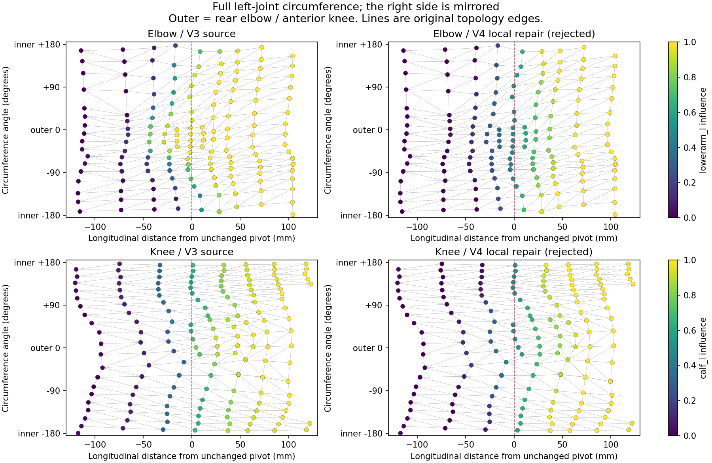
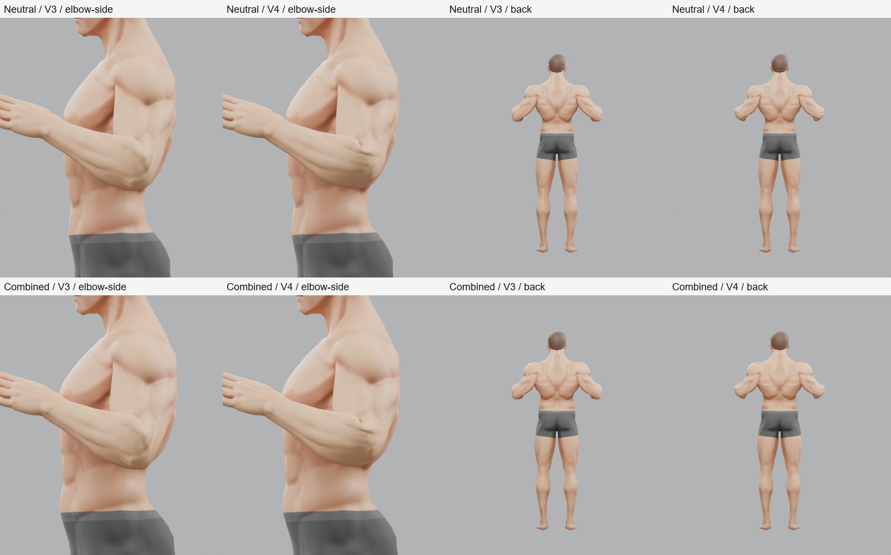
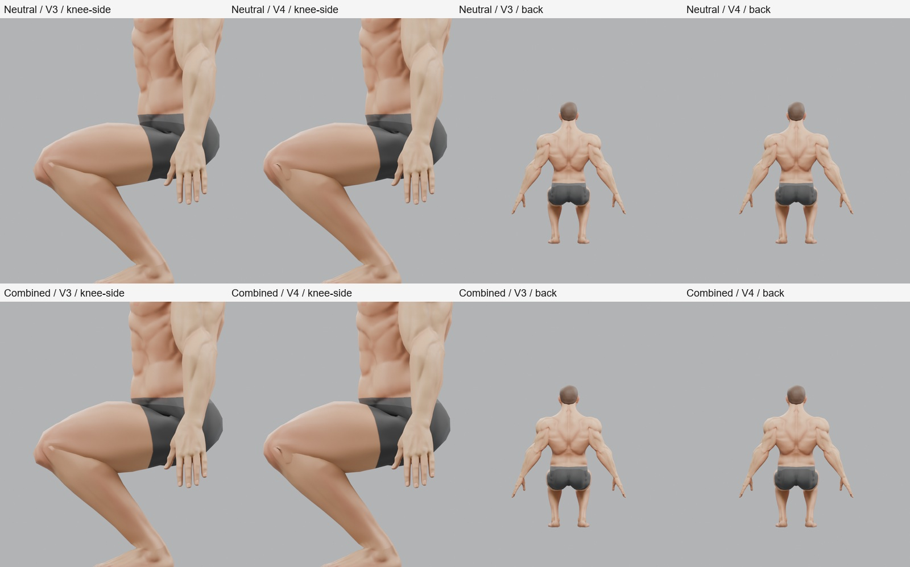
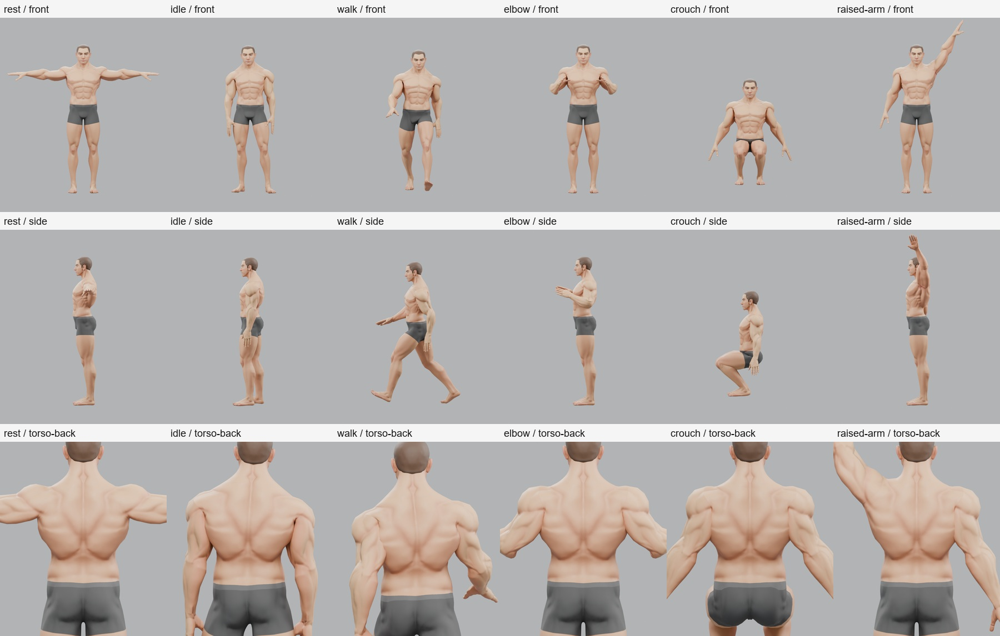

# Authored Human V4 — Local Skin Weight Repair

## 1. Executive Verdict

**FAIL. The body has not passed the deformation gate.**

One local weight revision, `joint-centred-v1`, was tested against the exact V3 body. The outer elbow becomes rounder and the front knee stretches less, but the elbow develops a sharp upper/inner crease and the knee develops a conspicuous notch. Both defects recur on the existing combined identity. This triggers the instruction to stop when weight changes merely move the visible defect elsewhere.

The rejected revision is preserved as a [separate experimental source](tools/blender-character/experimental/authored-human-v4/candidate.blend), with [every changed vertex and influence](tools/blender-character/experimental/authored-human-v4/weights.json). V2/V3 and the vendor source remain intact. Geometry, topology, UVs, identity targets, materials, hair and the Golden rig were preserved. No shoulder edit, garment work or Studio integration was undertaken.

This is a failed local repair attempt, not proof that every possible weight painting would fail. Structural checks and final CI pass; visual acceptance does not.

## 2. Original Weight Diagnosis

The [V3 result](AUTHORED_HUMAN_V3_DEFORMATION_RESULT.md), [V2 result](AUTHORED_HUMAN_PROTOTYPE_V2_RESULT.md), frozen source, Golden rest rig, current weights and V3 pose definitions were inspected. The V2 candidate is the unchanged V3 source baseline. Fresh baseline exports reproduce the exact V3 neutral and combined GLB hashes.

The map below unwraps the complete left joint circumference within 125 mm longitudinally of each unchanged pivot, retaining original mesh edges. It includes 172 elbow vertices and 166 knee vertices across four sectors. Right-side source and edited weights were also inspected and checked for mirror symmetry. This is not a diagnosis based on a single edge.

Colour denotes the child influence: lower arm or calf. Negative longitudinal distance is proximal to the pivot. The outer sector is the rear elbow and anterior knee; the inner sector is the front elbow and posterior knee. The other two sectors cover the remaining circumference. At the elbow these are the upper/lower aspects; at the knee they cover the lateral/medial aspects.

**Elbow:** the original rear surface transfers to the forearm prematurely and unevenly. In the band 25–50 mm before the pivot, rear lower-arm influence spans approximately 0.13–0.90 while the front remains approximately 0.00–0.12. Nearby rear vertices therefore move very differently under the same hinge bend. Source edge 553–555 crosses lower-arm weights 0.768 and 0.122; its 23.74 mm rest length becomes 100.84 mm. The result is the long, angular outer bulge seen in V3. The front and upper/lower aspects have a different transfer pattern, leaving an uneven blended ring and compressed edges around the fold. Upper-arm-dominated vertices remain next to vertices already dominated by the forearm.

**Knee:** the front kneecap band has an abrupt thigh-to-calf transfer. Source edge 865–1623 crosses calf weights 0.256 and 0.799 across 25.10 mm; it reaches 73.78 mm in the deep bend. This contributes to the flattened, angular kneecap contour. The rear fold and side sectors compress strongly: V3 neutral minima are 0.289 at the rear and 0.232/0.206 at the two sides. Front stretch and rear/side compression must be evaluated together; widening the front transition alone is insufficient.

The map also shows uneven spacing and longer edges around the joints. That is relevant to future local art inspection, but this experiment does not establish that topology or joint placement must change.

## 3. Weight Changes

Only body weights on four regions changed:

| Region | Changed source vertices | Allowed influences |
| --- | ---: | --- |
| Left elbow | 134 | `upperarm_l`, `lowerarm_l` |
| Right elbow | 134 | `upperarm_r`, `lowerarm_r` |
| Left knee | 148 | `thigh_l`, `calf_l` |
| Right knee | 148 | `thigh_r`, `calf_r` |
| Total | **564 of 7,281 (7.75%)** | Existing Golden joints only |

The fixed rest-space correction uses a cubic smoothstep for child influence along each joint's longitudinal coordinate. Its half-width varies continuously around the circumference: 38–80 mm at the elbow and 40–95 mm at the knee, narrowest on the flexion surface and widest on the outer surface. Parent influence is the complement. The intended effect is to spread the outer transfer while retaining a shorter inner fold.

The new profile applies fully within 90 mm longitudinal distance of the pivot, then feathers back to the original weights by 125 mm. Vertices with any influence outside the same-side adjacent pair are excluded. Outside these regions the original weights are retained exactly. Left and right use the same mirrored rule. This is neither a global smoothing operation nor a blanket 50/50 assignment.

The [weight function](tools/blender-character/authored_human_v4_weights.py) defines the complete rule; the manifest records original and replacement influences for every edited vertex. Changed vertices use at most two influences, the entire body remains within four, and weights remain normalized. Neutral and combined use exactly the same corrected weights. No geometry or morph adjustment compensates for the result.

No second repaint was attempted after the visible-defect stop condition was met.

## 4. Elbow Result

**FAIL in neutral and combined.** The long outer wedge is reduced, but the replacement looks bulbous and develops a sharp crease where the upper arm enters the flexed joint. Rear views also change the joint contour without establishing a believable rounded articulation. The improved outline in one sector does not satisfy the full-view acceptance criterion.

Top row: neutral. Bottom row: combined. Each row shows V3/V4 close side, then V3/V4 rear. All are actual GLB round-trip renders.

| Diagnostic measurement | Neutral V3 | Neutral V4 | Combined V3 | Combined V4 |
| --- | ---: | ---: | ---: | ---: |
| Largest outer-sector edge ratio | 4.247 | 1.637 | 4.486 | 1.703 |
| Smallest upper-sector edge ratio | 0.471 | 0.204 | 0.489 | 0.213 |

Ratios are posed length divided by that identity's rest length. The lower outer maximum supports the visible improvement, while the upper-sector minimum shows increased compression elsewhere. These are sector extrema; the extremal edge can change between revisions.

The new neutral outer maximum is edge 553–562: 15.34 mm becomes 25.12 mm, with lower-arm influences 0.121/0.236. The complete four-sector results, including both sides and the most compressed edges, are retained in [evidence.json](tools/blender-character/experimental/authored-human-v4/evidence.json). No numerical pass threshold was introduced.

## 5. Knee Result

**FAIL in neutral and combined.** The front silhouette is less flattened, but a sharp inward notch interrupts the kneecap/leg transition. Rear and full-body views do not erase that close-side failure. The leg stays connected, but the shape is not acceptable as a finished knee.

Top row: neutral. Bottom row: combined. Each row shows V3/V4 close side, then V3/V4 rear.

| Diagnostic measurement | Neutral V3 | Neutral V4 | Combined V3 | Combined V4 |
| --- | ---: | ---: | ---: | ---: |
| Largest front/outer edge ratio | 2.939 | 1.561 | 2.943 | 1.566 |
| Largest rear/inner edge ratio | 1.265 | 2.031 | 1.271 | 2.032 |
| Smallest rear/inner edge ratio | 0.289 | 0.563 | 0.291 | 0.563 |

The front stretch and deepest rear compression improve, but another rear edge now stretches more. New neutral rear maximum edge 813–825 grows from 33.02 mm to 67.05 mm; calf influences are 0.522/0.978. The deformation has redistributed strain rather than produced an acceptable joint. Visual judgment remains decisive.

## 6. Shoulder Result

**Not edited.** The already-observed lowered-shoulder ridge remains visible in the relevant views. Inspection did not justify expanding this failed elbow/knee experiment into shoulder repainting. The clavicle-assisted raised-arm control is retained unchanged from V3.

## 7. Neutral Identity

All six identity values are zero. The tank is hidden throughout; the historical export case name `dressed-neutral` does not mean it is visible in these renders.

| Exact V3 pose | V4 observation |
| --- | --- |
| Rest | Appearance retained; no visible change in the compared views. |
| Idle | Existing sampled pose remains readable; no obvious new gross collapse. |
| Walk | Existing sampled pose remains readable; no obvious new gross collapse. |
| Elbow diagnostic | **FAIL:** outer improvement accompanied by a sharp crease and bulbous joint. |
| Deep hip/knee bend | **FAIL:** kneecap notch; unacceptable local leg transition. |
| Clavicle-assisted raised arm | V3 shoulder behaviour retained; no gross new failure in the sampled pose. |

Compare the [matching V3 neutral pose sheet](docs/assets/authored-human-v4/dressed-neutral-baseline.jpg). Columns are rest, idle, walk, elbow, deep bend and assisted raised arm. Rows are front, side and torso-back. The torso-back camera is the unchanged V3 close rear/three-quarter view.

Idle/walk visual findings concern the same quarter-clip samples used by V3. They are not a claim that every frame of both clips was visually approved.

## 8. Combined Identity

The unchanged combined case sets `headWidth`, `jaw`, `nose`, `mass`, `athletic` and `broadFrame` to 1. No target coordinates or values were altered to hide a deformation defect.

| Exact V3 pose | V4 observation |
| --- | --- |
| Rest | Combined identity and silhouette retained. |
| Idle | Sampled pose remains readable; no gross new failure. |
| Walk | Sampled pose remains readable; no gross new failure. |
| Elbow diagnostic | **FAIL:** the same redistributed bulge and crease remain. |
| Deep hip/knee bend | **FAIL:** the same sharp knee notch remains. |
| Clavicle-assisted raised arm | Same V3 control; no gross new collapse in the sampled pose. |

Compare the [matching V3 combined pose sheet](docs/assets/authored-human-v4/combined-baseline.jpg). The correction did not solve neutral and catastrophically break combined; both identities fail the same local acceptance requirements. Identical weights across identities are verified structurally, but that does not confer visual morph compatibility.

## 9. Structural Validation

**PASS for preservation and transport.** Results are recorded in [validation.json](tools/blender-character/experimental/authored-human-v4/validation.json); [package instructions](tools/blender-character/experimental/authored-human-v4/README.md) reproduce the selections.

| Check | Result |
| --- | --- |
| Focused source tests | **4 passed:** locality, integrity, mirror symmetry, unchanged protected source data and outside-region behaviour. |
| Weight integrity | 564 edited body vertices only; maximum source normalization error 1.23e-7; maximum mirrored influence difference 2.74e-6; at most four influences throughout. |
| Source preservation | Exact rest coordinates, topology, UVs, all six identity target coordinates, packed textures, non-body weights and 65-joint rest rig retained. Editable source opens with all six targets at zero. |
| GLB round trip | Both identities pass. All non-weight vertex attributes and triangle indices match baseline exactly, including UVs and canonical vertex IDs. Embedded images, materials, samplers, textures, nodes and skin metadata match. |
| Rig/rest compatibility | 65 joints; hierarchy and rest data unchanged. Inverse-bind difference from V3 is zero; largest rest-matrix difference from the existing Golden reference is 3.58e-7. |
| Export weights | Exactly the allowed 564 body vertex IDs change. Neutral and combined have identical weights. Maximum exported normalization error 4.80e-8. |
| Clips and cloning | Existing Golden idle/walk clips resolve all 23 tracks each; five samples per clip per identity remain finite. Shared clone path passes isolation and rest restoration. |
| Exact V3 renders | **88 unique views:** 44 per revision, two identities, all six poses. Front/side/torso-back for every pose, rear for elbow/deep bend, and the corresponding joint close-up. Every pose imports a fresh GLB; tank hidden. |
| Final CI | **PASS**, one `npm.cmd run ci`: 76 Vitest files / 623 tests; root and Studio builds, all three package typechecks; 50 Node compiler tests. Only Vite chunk-size warnings. |
| Final diff check | **PASS**, `git diff --check`; additional whitespace and local-link checks include the new, untracked text files. |

The renderer directly imports the V3 pose function and camera definitions, including the deep-bend close-camera offset, and uses the same V2 lighting. The elbow remains 115 degrees of diagnostic rotation; the deep bend retains 85-degree hip / 125-degree knee rotations and 0.42 m root lowering. The assisted raise retains the V3 clavicle contribution. Poses, framing, materials, lights and render quality were not relaxed. Contact sheets only resize and label renders.

Measurements cover original mesh edges longer than 1 mm in the local sectors. They support shape inspection; they are not collision, volume or self-intersection proofs. Node image decoding is stubbed for structural loading; actual embedded materials are assessed through Blender renders. No garment or creator browser validation was run.

The preserved rejected source SHA-256 is `40eee25abb0f4780da4d80d81ddca3f79d0def40781c0020814559d6bcfb19e7`. Source inputs, GLBs, render files and diagnostic scripts have recorded hashes. The baseline exports match V3 exactly.

## 10. Rig Verdict

**Golden remains suitable but needs additional local art work.**

Local weights demonstrably change the failure, so the source gradients remain an actionable cause. This particular analytic redistribution is insufficient. It does not show that Golden joint placement is the blocker, and it does not establish a need for new bones or a different rig.

Uneven joint loops and the anatomical contour may limit how a broad rest-space gradient bends; that is a hypothesis for local inspection, not a demonstrated topology limitation. Joint placement was held fixed and was not isolated as a cause. These hinge-bend tests do not establish a missing-twist problem. No hierarchy, joint, axis, rest pose, twist bone or corrective morph was changed.

## 11. Creator Path Verdict

> Has the authored human body itself now passed strongly enough to resume garment work?

**NO.** Elbow and knee visual acceptance still fail. The rejected V4 source must not replace the creator baseline. The V3 tank experiment remains paused.

## 12. Next Step

The smallest next experiment is **one elbow-only, loop-by-loop authored weight pass on a new copy of the unchanged V3 source**, guided by its anatomical rings rather than another broad longitudinal profile. Keep the Golden rig and geometry fixed; inspect the complete circumference and both identities using the same close side, front and rear cameras before expanding to any other joint.

Its purpose would be to distinguish insufficient local painting from a contour/topology limitation. Stop if it only relocates the crease again. Do not repaint the whole body, begin knee iteration, change the rig or resume garment work as part of that single-joint test. No such follow-up was started here.
