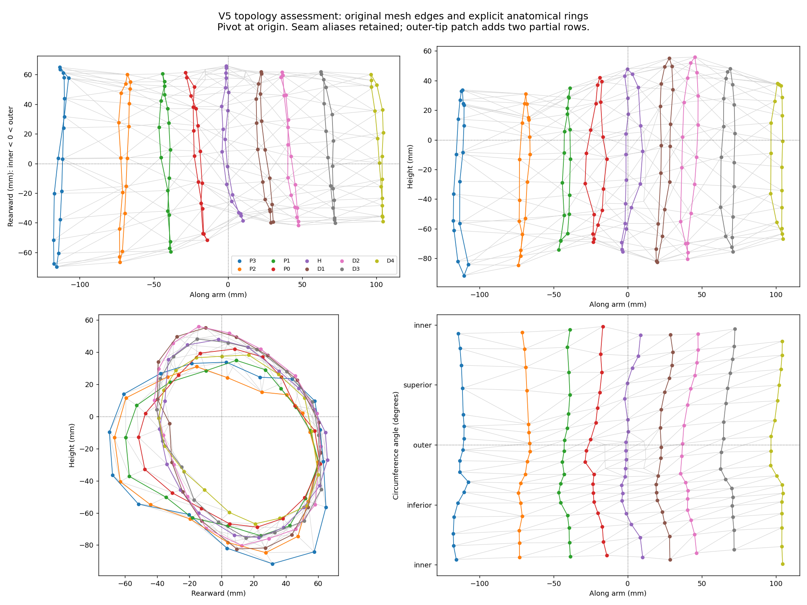
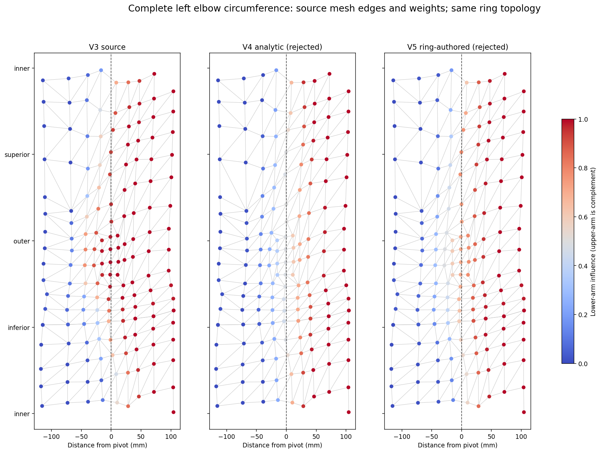
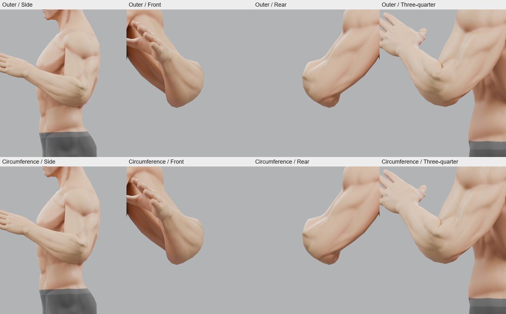
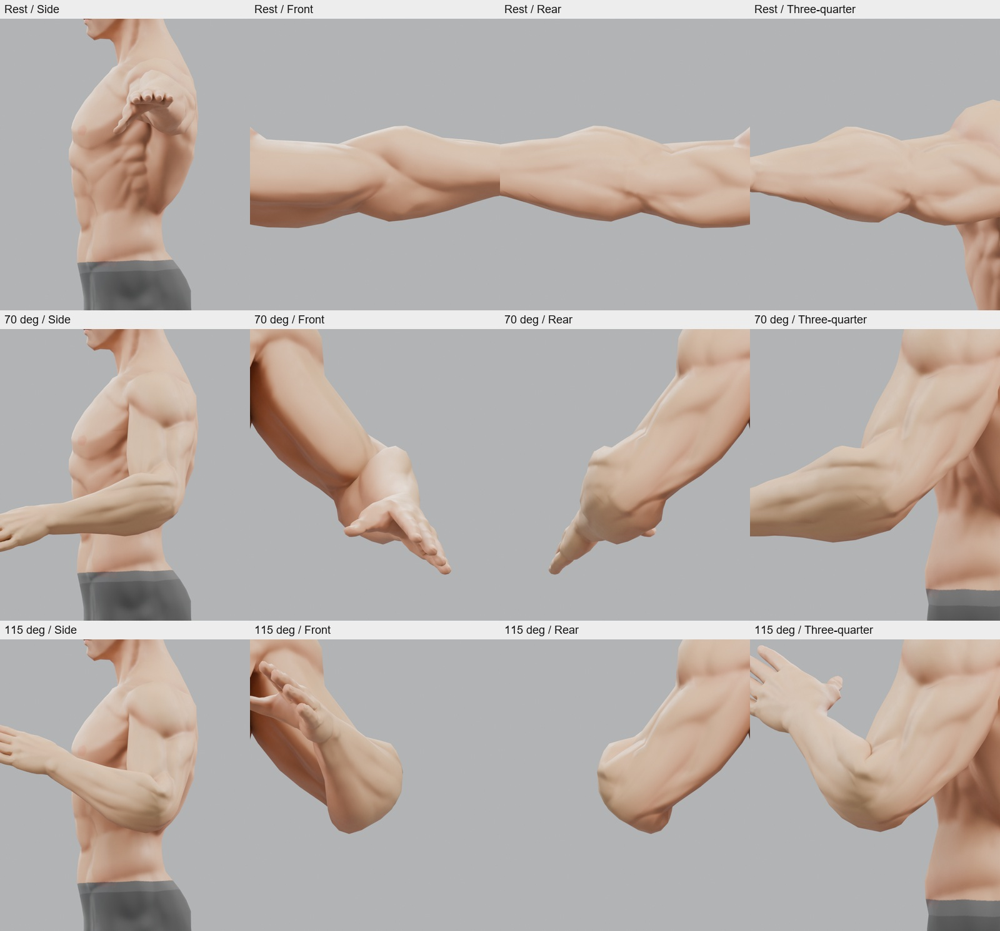
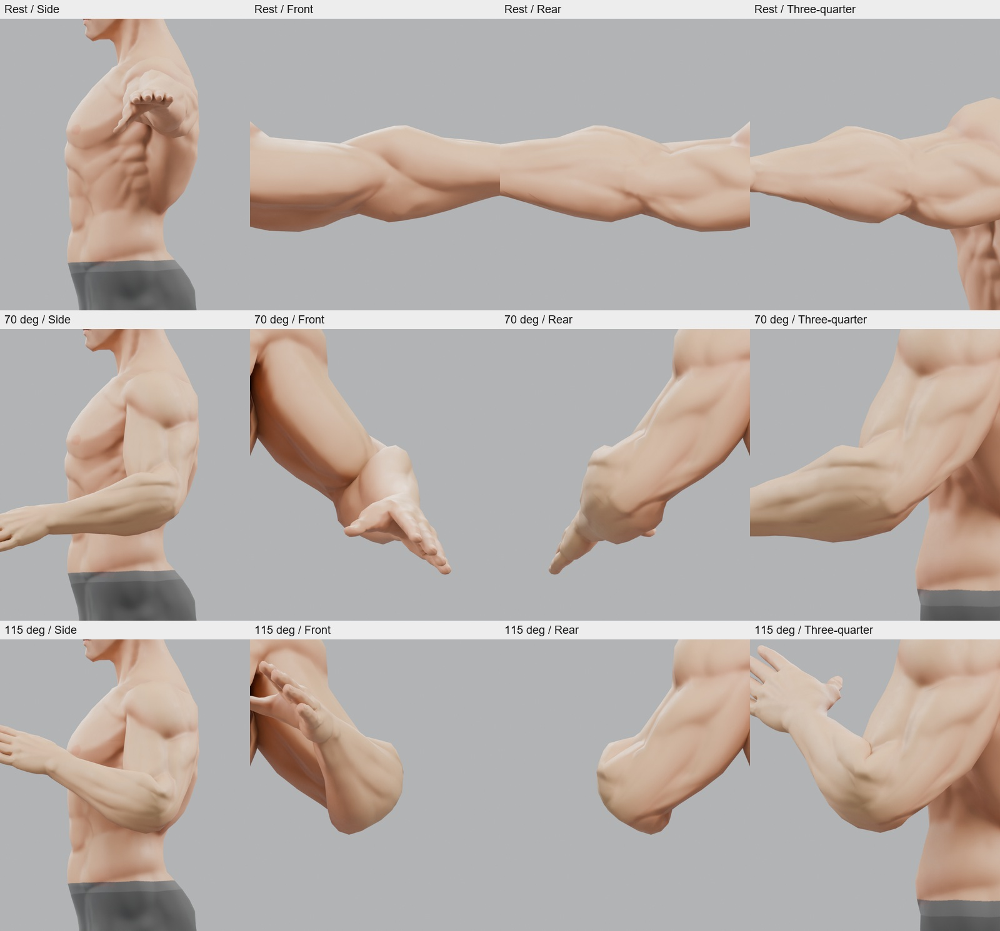
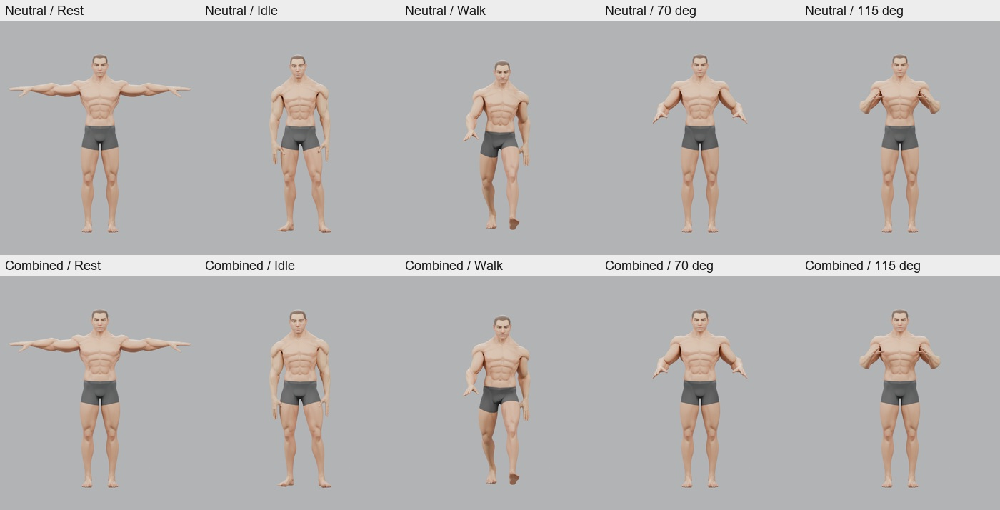
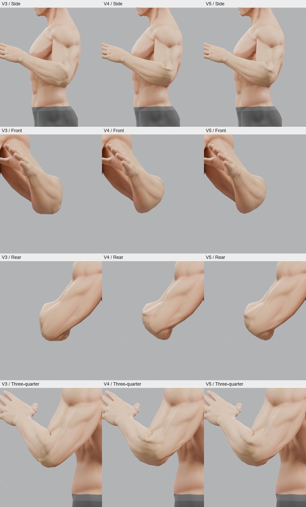
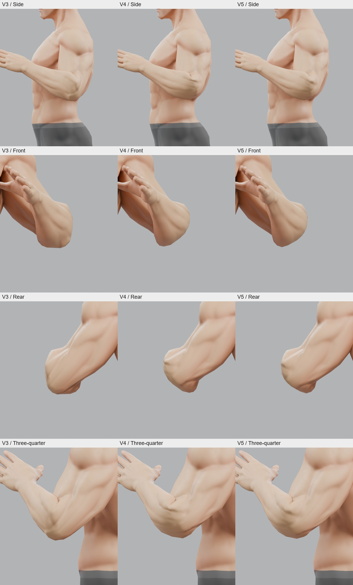
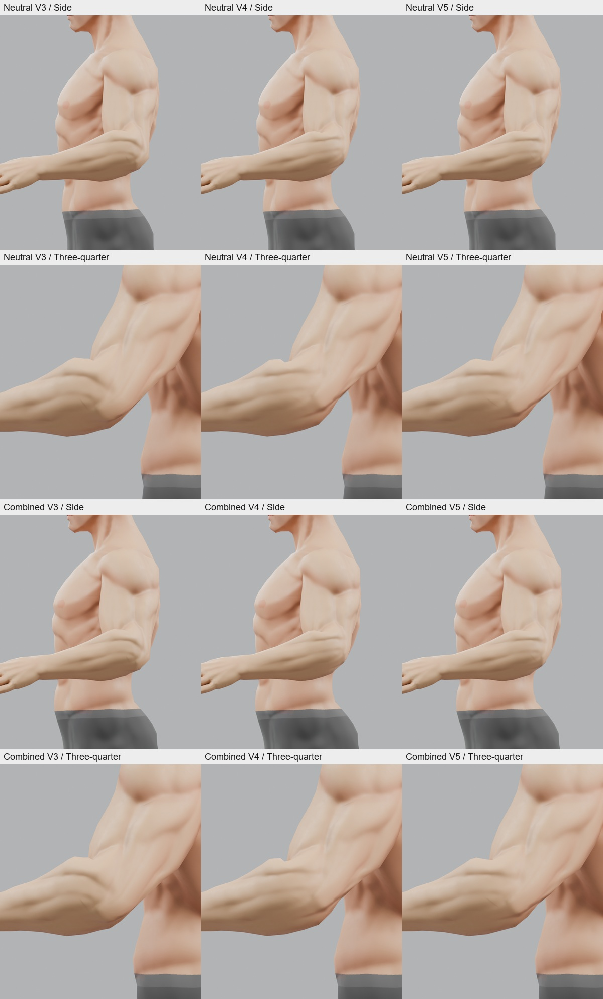

# Authored Human V5 — Elbow Art-Directed Skinning Gate

Investigation: 6 October 2026. Blender 5.2.0 LTS, build `fbe6228777e7`.
[Experimental package and reproduction](tools/blender-character/experimental/authored-human-v5/README.md).

## 1. Executive Verdict

**FAIL — the elbow does not pass the visual gate. Outcome B.**

A single deliberate, vertex-authored ring pass was applied in two inspected
left-elbow checkpoints, starting from the unchanged V3 source. It reduces V3's
long outer wedge, but the 70-degree bend retains a raised shelf at the fold and
the unchanged 115-degree bend retains a pinched upper/inner transition and a
bulbous, angular elbow. Both neutral and the existing combined identity fail.
The full-circumference checkpoint reached the stop rule; no further weight
strategy was attempted.

This is evidence that the current local topology/contour is limiting this
fixed-rig, weights-only approach. It is not a mathematical proof that no possible
set of weights could work, nor an isolated diagnosis of Golden joint placement.
It is sufficient to stop weight-only iteration and require a local geometry
experiment before accepting this base.

The [rejected candidate](tools/blender-character/experimental/authored-human-v5/candidate.blend)
retains the same tested weights on both elbows for inspection. It is not an
accepted source for promotion. The V2/V3 and rejected V4 packages remain intact.

## 2. Topology Assessment

The actual V3 mesh was inspected before painting. The left elbow map covers
**172 source vertices, 463 nonzero original edges and 292 triangles**. Nine
circumferential rings were traced by source vertex ID and verified as closed
paths along existing edges, allowing coincident UV/normal seam aliases in the
analysis. The source mesh itself was never welded, reordered or edited.

The origin is the unchanged left lower-arm pivot, approximately
`(0.463012, 0.073000, 1.455500)` metres in Blender source coordinates. The arm runs
along +X. Anterior/-Y is the inner flexion surface; posterior/+Y is the outer
extension surface. The two remaining side aspects are labelled superior/+Z and
inferior/-Z in the source T pose, avoiding ambiguous camera-relative
lateral/medial labels. These labels follow the arm when posed.

| Ring | Position relative to pivot, mm | Role in the pass |
| --- | ---: | --- |
| P3 | -117.6 to -107.5 | Unchanged proximal context/boundary |
| P2 | -73.8 to -65.8 | Mostly upper-arm control; beginning of broad outer transfer |
| P1 | -46.5 to -38.7 | Upper-arm dominated, with distinct outer and inner weights |
| P0 | -28.8 to -14.1 | Proximal transition/fold support |
| H | -4.3 to +10.1 | Joint-crossing ring; asymmetric circumferential transition |
| D1 | +19.0 to +30.5 | Mostly lower-arm control |
| D2 | +35.6 to +47.5 | Completion of transfer into forearm |
| D3 | +62.6 to +72.3 | Unchanged distal boundary |
| D4 | +96.4 to +104.7 | Unchanged distal context |

Most rings contain 17 unique positions; H contains 19. Nine duplicated seam
vertices and eight extra outer-tip patch vertices complete the mapped domain.
Two four-vertex partial rows lie between P0/H and H/D1 on the posterior tip.
Their weights were authored separately to continue the surrounding rings.

Mean longitudinal gaps between successive rings are **43.1, 28.3, 20.7, 21.8,
23.5, 17.4, 26.7 and 33.4 mm**. Around-ring edge lengths vary from roughly
12.6 to 36.5 mm. Existing diagonals cross between rings; the posterior tip is
denser than the inner fold and the upper/lower side surfaces. The map retains
those directions rather than inferring rings from X position alone.

Rest close-ups also expose pronounced existing sculpted grooves before any
bending. The rest contour is strongly asymmetric around the pivot: the hinge ring
extends about 48 mm upward and 75 mm downward, while its anterior surface
recedes relative to P1/P0 and the forearm immediately broadens beyond it. There
are usable connected rings, so this was a credible local-skinning experiment.
However, the sparse fold and abrupt sculpted contour transitions remain visible
under the deliberate pass. Connectivity alone is insufficient to approve this
surface as a convincing elbow.

[Complete topology map, IDs, normals, faces, spacing and weights](tools/blender-character/experimental/authored-human-v5/topology.json).

## 3. Original Weight Problem

[V3](AUTHORED_HUMAN_V3_DEFORMATION_RESULT.md) carries several posterior vertices
into lower-arm control prematurely. The clearest source edge, **553–555**, jumps
between lower-arm influences **0.768 and 0.122** over 23.74 mm; it reaches
100.84 mm at the neutral 115-degree bend. The outer transition therefore forms
a long angular wedge while other circumference sectors fold differently.

[V4](AUTHORED_HUMAN_V4_SKINNING_RESULT.md) spreads that transfer with an analytic
profile. Its outer stretch improves, but it introduces a sharper upper/inner
crease. V5 deliberately does not reuse that corrected source or its knee edits.
The frozen V2 candidate is the exact unchanged V3 source, and fresh V5 baseline
exports reproduce both V3 GLB hashes.

Colour is lower-arm influence; upper-arm influence is its complement. All
original and final values across the full circumference are retained in the
linked topology and weight records, including unchanged boundary vertices.

## 4. Authored Weight Pass

This is **explicit vertex/ring authoring encoded in a reviewable table**, not a
claim of interactive brush painting by a human artist. Actual connected rings,
source contours and rendered checkpoints determined the regions. There is no
smoothstep, longitudinal fit, automatic weight optimizer or pose-specific weight
change. Each edited source vertex has an explicit value in
[the authored table](tools/blender-character/authored_human_v5_weights.py).

Representative lower-arm weights show the circumferential design:

| Ring | Inner/superior fold | Superior side | Outer tip | Inferior side |
| --- | ---: | ---: | ---: | ---: |
| P2 | 0.020 (469) | 0.015 (465) | 0.080 (555) | 0.040 (467) |
| P1 | 0.035 (456) | 0.100 (435) | 0.300 (553) | 0.150 (447) |
| P0 | 0.180 (538) | 0.420 (534) | 0.490 (562) | 0.350 (536) |
| H | 0.620 (454) | 0.780 (433) | 0.700 (640) | 0.600 (444) |
| D1 | 0.880 (713) | 0.930 (724) | 0.850 (561) | 0.900 (710) |
| D2 | 0.980 (703) | 0.985 (707) | 0.950 (727) | 0.985 (721) |

Parentheses are source vertex IDs. Intermediate positions around each ring have
individually listed values; this is not four disconnected constant sectors.
P2/P1 retain the upper arm, P0/H form the transition, and D1/D2 retain the
forearm. The inner fold concentrates transfer around P0/H/D1; the outer region
starts earlier and spans more rings. Side values connect these treatments.
The outer partial rows use 0.59–0.60 and 0.78–0.79 respectively.

The actual review sequence was:

1. Change **58 left outer/adjacent vertices**, export, and inspect the 115-degree
   side, front, rear and three-quarter views. The wedge reduces; an inner/top
   shelf remains.
2. Apply the adjacent side/flexion entries, bringing the left total to **118**.
   Re-export and inspect **both identities at 70 and 115 degrees**, all four
   views. The fold remains shelf-like/pinched and the joint remains bulbous.
3. Stop weight painting. Copy the same tested left values to all matching right
   vertices, including duplicated seam vertices, for a symmetric rejected
   artifact. No accepted left result existed; mirroring is preservation and
   inspection, not an acceptance claim.

Final change: **236 of 7,281 body vertices (3.24%)**, exclusively within the six
painted elbow rings and outer-tip patch, less than 74 mm longitudinally from
each pivot. Edited vertices use only their same-side upperarm/lowerarm pair.
All non-elbow weights are exact. At most four influences remain anywhere in the
body; changed vertices use two, normalized to one. Neutral and combined use
identical final weights. No other joint or protected art data was changed.

## 5. Neutral Result

**FAIL.** All six identity values remain zero.

Rows are rest, 70 degrees, and the unchanged 115-degree diagnostic. Columns are
existing close side, new local front, rear and three-quarter views.

- **Rest:** source appearance retained. The legacy side camera looks along the
  T-pose arm and is partly occluded; front/rear/three-quarter and the topology
  map expose the actual rest elbow. No neutral geometry adjustment was made.
- **70 degrees:** the side and three-quarter views show a raised shelf across
  the proximal forearm/fold; the rear shows an angular contour transition.
- **115 degrees:** V3's long wedge is reduced, but the joint remains rounded
  into a bulky mass with an abrupt upper/inner crease. Front/rear inspection
  does not establish a coherent, natural articulation around the circumference.
- **Idle/walk:** the unchanged quarter-clip samples remain readable at full-body
  distance, with no gross new separation. This does not overturn the close-bend
  failure or approve every animation frame.

## 6. Combined Result

**FAIL.** `headWidth`, `jaw`, `nose`, `mass`, `athletic` and `broadFrame` remain
exactly **1**. No identity value or target was eased for the elbow.

Rest retains the combined identity. The 70-degree shelf persists and the
115-degree bend repeats the pinched upper transition and bulky/angular outer
shape. The same weights therefore fail the required pair; this is not a
neutral-only success with a hidden morph regression. The sampled idle/walk
poses remain readable, subject to the same limited observation as neutral.

Full-body context, neutral above combined: rest, idle, walk, 70 degrees, 115 degrees.

[Front, side and close rear idle/walk sheet](docs/assets/authored-human-v5/animation.jpg).

## 7. V3 vs V4 vs V5

Each extreme comparison has **V3 / V4 / V5 columns**, with side, front, rear and
three-quarter rows. These are actual GLB round-trip renders with identical
cameras and lighting, not illustrations or retouched model images.

[Matching 70-degree front/rear comparison](docs/assets/authored-human-v5/intermediate-front-rear-comparison.jpg).

The numeric domain is the same **463 original left-elbow edges longer than
1 mm** in the explicit nine-ring patch, measured in each identity's own rest
shape. Ratios are posed/rest length; the minimum records maximum compression.
The extremal edge can differ between revisions. No visual pass thresholds are
introduced.

| Identity / bend | V3 maximum stretch | V4 maximum stretch | V5 maximum stretch | V3 minimum ratio | V4 minimum ratio | V5 minimum ratio |
| --- | ---: | ---: | ---: | ---: | ---: | ---: |
| Neutral / 70 degrees | 3.258 | 1.516 | 1.810 | 0.390 | 0.435 | 0.399 |
| Combined / 70 degrees | 3.416 | 1.556 | 1.876 | 0.362 | 0.423 | 0.380 |
| Neutral / 115 degrees | 4.247 | 1.637 | 2.043 | 0.330 | 0.204 | 0.248 |
| Combined / 115 degrees | 4.486 | 1.703 | 2.144 | 0.319 | 0.213 | 0.267 |

V5 reduces V3's outer stretch but does not improve on V4's maximum stretch.
Its most compressed extreme edge is somewhat less compressed than V4's worst,
yet the visible fold still fails. At 115 degrees the V5 worst edge loses about
75.2% of its neutral rest length and 73.3% of its combined rest length.

Representative **neutral, 115-degree** transitions:

| Original edge / rest length | V3 lower-arm weights; posed length | V4 lower-arm weights; posed length | V5 lower-arm weights; posed length |
| --- | --- | --- | --- |
| 553–555 / 23.74 mm, outer P1/P2 | 0.768 / 0.122; 100.84 mm | 0.121 / 0.012; 36.44 mm | 0.300 / 0.080; 48.29 mm |
| 553–562 / 15.34 mm, outer P1/P0 | 0.768 / 0.896; 21.90 mm | 0.121 / 0.236; 25.12 mm | 0.300 / 0.490; 31.33 mm |
| 585–595 / 22.52 mm, upper/flexion H/P0 | 0.938 / 0.582; 10.61 mm | 0.546 / 0.259; 6.95 mm | 0.770 / 0.350; 5.58 mm |

Across the whole local patch, maximum adjacent child-weight difference falls
from **0.672 (V3)** to **0.503 (V4)** to **0.460 (V5)**. Maximum neutral gradient
per rest millimetre is **0.02864 / 0.01681 / 0.01874** respectively. No sudden
0-to-1 painted edge exists. Smaller weight jumps still do not guarantee a good
contour: the table shows reduced strain on one edge and increased strain or
compression on another.

[Complete per-edge measurements for both sides, identities and rendered poses](tools/blender-character/experimental/authored-human-v5/evidence.json).
These are supporting edge diagnostics, not proofs of volume preservation,
collision freedom or an exhaustive search over possible weights.

## 8. Structural Validation

**PASS for the completed source and GLB checks. Visual acceptance remains FAIL.**

| Check | Result |
| --- | --- |
| Focused tests | **5 passed:** ring connectivity, source preservation, elbow-only integrity, mirror/seam continuity, exact existing poses and the new 70-degree sample |
| Weight integrity | 118 changes per side; maximum source sum error 1.23e-7; two influences on edited vertices; at most four throughout |
| Symmetry | Maximum mirrored edited-weight difference **0**; coincident seam pairs match |
| Protected source | Exact neutral coordinates, topology, UVs, six target coordinates, packed images, non-body weights and 65-joint rest rig; all keys saved at zero |
| Non-elbow state | Every non-elbow body weight exactly matches V3; no knee/shoulder/garment/face/hair/material edit |
| GLB round trip | Both identities load; all non-weight vertex attributes, triangle indices, embedded images, materials, textures, nodes and skin metadata match their V3 baselines |
| Identity weights | Neutral and combined weights match exactly; maximum exported sum error 4.80e-8 |
| Golden rig/rest | 65 joints; unchanged hierarchy; inverse-bind difference from V3 **0**; maximum rest-matrix difference from the existing Golden/legacy compiled reference **3.58e-7** |
| Idle/walk | All 23 tracks resolve in each clip; five samples per clip per identity remain finite and move the rig |
| Shared cloning | Actual `cloneThreeVisualAssetRoot` path; separate bones, untouched second clone, successful rest restoration |
| Pose/camera preservation | Exact existing rest/idle/walk/115-degree pose matrices; original side/context cameras and V2 lights retained; added close cameras numerically equal across V3/V4/V5 |
| Render evidence | **94 selected views:** 20 iterative checkpoints and 74 final/comparison views; both identities only; every pose imports a fresh GLB |
| Final CI | **PASS**, one `npm.cmd run ci`: 76 Vitest files / 623 tests; root and Studio builds; three package checks; 50 Node compiler tests. Existing Vite chunk-size advisories only |
| Diff/whitespace | **PASS**, `git diff --check`; new untracked V5 text files and all local report links also checked |

The original V3 source SHA-256 is
`ebd603dc9ae51d121d53acfc60d5fb79eac29dbcb14348e0efc887e3471735a4`.
Fresh baseline exports match V3 exactly. Input preservation compares the initial
V5 snapshot with final inputs. Five V2 JSON sidecars already differ from their
old manifest hashes; they remain byte-identical throughout V5. Both Blender
sources still match the old manifest, and the sidecar discrepancies are recorded
without rewriting the historical package. The package records candidate, input,
script and render hashes. [Final validation record](tools/blender-character/experimental/authored-human-v5/validation.json). Source and exported preservation are independently
checked, rather than inferred from the author's intended edit scope.

The original diagnostic remains **115 degrees**, with its existing upper-arm
rotations. The additional **70-degree** sample changes only that elbow rotation.
The new front/rear/three-quarter cameras target the unchanged posed elbow pivot
at fixed offsets and scale 0.42. Existing side/context framing remains unchanged.
All 94 selected views were visually inspected, through the labelled sheets and
selected original-resolution images. All renders retain 720 x 840 resolution,
24-sample Cycles, original materials,
V2 lights and AgX. Sheets only resize and label the actual images.

Node image decoding is stubbed for structural loading; Blender renders decode
the embedded textures. Idle/walk visual findings cover the existing quarter-clip
samples, not every frame. No garment validation, body matrix, creator browser
test or unrelated Blender gallery was run.

## 9. Elbow Verdict

> Can this mesh produce an acceptable elbow bend with the current topology and Golden rig using authored weights alone?

**NO — not demonstrated by this deliberate local pass; the required gate fails.**

Under the requested experiment, both identities and both bend depths retain
unacceptable fold/contour discontinuity. Classify this as **Outcome B: evidence
of a local topology/contour limitation**, strong enough to stop further skinning
attempts on the unchanged elbow. Do not reinterpret structural success or reduced
edge stretch as visual acceptance. This verdict is bounded to the experiment,
not a universal impossibility theorem about all conceivable weight assignments.

## 10. Human Base Verdict

> Is there now enough evidence to treat this authored human as a viable base for the future creator?

**NO.** The required elbow gate still fails. The authored human remains a
candidate for further local geometry investigation, but it has not earned
creator-base acceptance. This experiment does not resolve prior joint or garment
findings and does not authorize integration or a broader repaint.

## 11. Next Step

Recommend **one local topology/retopology experiment around the elbow**, retaining
the Golden rig and the same neutral/combined identities and diagnostic views.
Use the ring/edge map to address the abrupt inner/side contour transition and
uneven support around the fold before any further skinning attempts.

That next experiment was **not started**. No knee pass, rig change, twist bone,
corrective morph, whole-body repaint or Asset Studio integration follows this
report automatically.
