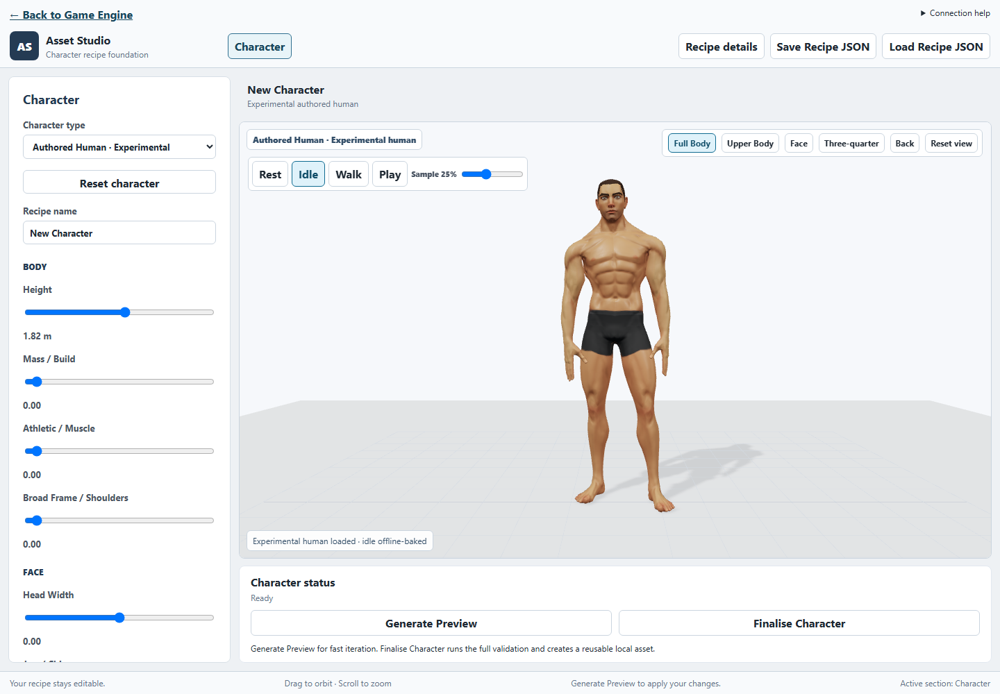

# Canonical Authored Human — Integration Result

6 October 2026 · Blender 5.2.0 LTS (`fbe6228777e7`).

## 1. Executive Result

**PASS — a usable experimental authored human is now in the real Asset Creator.**
New characters open this family by default. The body received a coordinated
contour and skinning pass, retains its face/fingers and six identity dimensions,
and works with Golden idle/walk. The large viewport, body/face controls, camera
presets, Generate Preview, Finalise Character and return to the engine are working.

This is a muscular, stylised male foundation, not a finished universal character
library. Deep bends retain local creasing. The optional tank remains unfinished
and is not exposed. Neither limitation blocks the base-human workflow.



## 2. Canonical Source

The accepted package is
[authored-human-canonical-v1](tools/blender-character/experimental/authored-human-canonical-v1/README.md).
Its source is V2 `candidate.blend`, which is also the unchanged V3 body source.
V4/V5 informed the diagnosis but their rejected weight passes were not promoted.

Provenance is Quaternius Superhero_Male_FullBody + Hair_Buzzed → packed V2 with
six morphs → canonical-v1 local art revision. Vendor sources, V2–V5 and legacy
procedural assets are unchanged. The original candidate hash is
`ebd603dc9ae51d121d53acfc60d5fb79eac29dbcb14348e0efc887e3471735a4`;
the canonical source hash is
`7773ca3ee38eeb5ff168783d8753b7adb49c79499f273b050cd105f75763a63d`.
The package includes the source licence and vendor hash snapshot.

## 3. Whole-Body Diagnosis

Nine fresh baseline views were inspected before the body revision, alongside
the prior joint evidence. [Baseline diagnostic sheet](docs/assets/authored-human-canonical-v1/baseline-audit.jpg).

| Region | Initial diagnosis and scope |
| --- | --- |
| Neck, head | Usable in head turn; no rig limitation established. Preserve. |
| Clavicle, shoulder, armpit, upper back | Uneven weight transitions and sculpted deltoid ridges; local weight/contour repair. The raised-arm diagnostic must involve the existing clavicle. |
| Upper arm, elbow, forearm | Weight and contour limited: large outer wedge, bulky transition and pronounced rest grooves. Existing connected rings are usable once the contour is softened. |
| Wrist, hands, fingers | Good authored anatomy; retain original geometry and weights, inspect an actual wrist/finger bend. |
| Chest, spine, waist, abdomen | Coherent stylised forms; preserve central contours and existing spine motion. |
| Pelvis, groin, hips, seat | Connected but compressed at deep flexion; soften local transitions without adding a corrective system. |
| Thighs, knees, calves | Knee contour/weight transitions create an angular cap and abrupt fold. Preserve thigh/calf anatomy outside the local joint region. |
| Ankles, feet | Acceptable in walk/deep bend; preserve. No detailed foot work needed. |

The deep crouch is the existing diagnostic, not a grounded squat animation.
Its pose limitations are not evidence for replacing Golden. No unavoidable
hierarchy or joint-placement defect was established.

## 4. Geometry / Topology Changes

One seam-aware local smoothing pass softens the elbow/knee grooves and shoulder/
pelvis transitions. It operates on the actual authored mesh adjacency, with
coincident UV seam aliases sharing neighbours. It does not reconstruct anatomy
from primitives. Six fixed iterations use stronger elbow/knee masks and lighter
shoulder/groin masks, fading into untouched surfaces.

**1,628 of 7,281 body vertices move; maximum Basis displacement is 24.13 mm.**
The existing **12,566 body triangles**, vertex order and all per-corner UVs remain
exact. No support loops, remeshing, whole-arm redesign or new bones proved
necessary for the intended framing. Face, hands and ankle/foot coordinates are
exact in every target. This is a contour correction plus weighting, not another
weights-only pass on the unchanged surface.

## 5. Skinning Changes

**1,552 body vertices change weights.** Elbows and knees use a local two-bone
transition with a broader outer transfer and a narrower inner fold, fading into
the original weights. Shoulder/upper-back and groin/pelvis transitions use local
adjacency smoothing, normalized and limited to four influences. Both sides use
the same region definitions. Central torso, neck, wrists and fingers retain
their original weighting where outside those regions.

The saved source has at most four influences per vertex and maximum weight-sum
error **1.23e-7**. No animation-dependent weighting or runtime corrective system
was introduced. The exact Golden rest rig remains unchanged.

## 6. Morph Preservation

Head width, jaw/chin, nose, mass, athletic and broad frame survive. Basis and
every identity target receive the **same fixed linear contour operator**, so
the local target deltas are deliberately migrated instead of discarded. Eyes,
brows and short hair retain their existing coordinated targets.

All eight non-neutral checks passed: head width ±1; jaw, nose, mass, athletic,
broad frame at +1; and the original all-ones combined identity. Neutral is the
fully validated default. Each compiled identity changes geometry while keeping
the same source-ID triangle/UV fingerprint. The shared clone/animation checks
also pass for all eight. [Identity views](docs/assets/authored-human-canonical-v1/identities.jpg).

The exposed ranges are head width −1…1 and the other five controls 0…1. This
does not claim a full range of body archetypes; most changes are deliberately
bounded, and muscle variation is subtle on this already muscular source.

## 7. Motion Acceptance

Neutral and combined were inspected with unchanged existing diagnostic angles.
[Neutral sheet](docs/assets/authored-human-canonical-v1/candidate-dressed-neutral.jpg) ·
[Combined sheet](docs/assets/authored-human-canonical-v1/candidate-combined.jpg).

| Pose | Verdict at the intended quality bar |
| --- | --- |
| Rest | Pass: coherent human silhouette and preserved face/hands. |
| Idle | Pass: connected anatomy; reduced back/shoulder ridge. A small posterior armpit crease remains in close inspection. |
| Walk | Pass: readable gait, preserved hips, calves, ankles and feet. |
| Clavicle-assisted raised arm | Pass: upper back stays continuous; residual armpit compression is acceptable for this stylised base. |
| Elbow ~70° | Pass: smoother outer silhouette and controlled inner transition. |
| Elbow ~115° | Pass at gameplay/conversation framing: the former long wedge is removed. Local inner-fold compression remains; not film-closeup quality. |
| Hip flexion ~85° | Pass: side and rear remain connected without gross seat/groin collapse. |
| Deep knee ~125° | Pass at the intended framing: rounded cap and continuous outer profile. A small side/flexion crease remains, especially combined. |
| Head turn | Pass: face, neck and hair remain coherent. |
| Wrist + finger bend | Pass in one neutral diagnostic sample; original Golden finger chains and weights remain usable. This is not a full grasp-animation acceptance suite. |

Idle/walk structural checks sample five times per clip; browser checks also
observe distinct 25%/75% poses. Visual Blender samples use the existing quarter
clips. Only idle/walk are present in the canonical animation folder; no run or
attack clip was invented or claimed as tested.

## 8. Rig Verdict

**Golden remains canonical: 65 joints, same names, hierarchy, axes and rest
placement.** The recipe carries `golden-humanoid-v0` explicitly. Inverse binds
are checked against cumulative bone rest transforms. Whole-character height is
a glTF scene-parent scale/translation, preserving those binds and clip tracks.
An early adapter check caught height being folded into binds; it was corrected
before fixture publication. No twist bones or new rig profile were needed.

## 9. Hair

The existing adapted Buzzed source is offered as **Short hair**, plus **No hair**.
Head-turn, head-width endpoints, jaw/nose and combined views retain a coherent
hairline with no visible scalp breakthrough in the selected views. Geometry and
its six targets are unchanged. Hair and brows receive the selected solid colour;
the hair normal texture survives. The manifest distinguishes approved canonical
correspondence from a per-build geometric clearance proof; continuous slider
space is not exhaustively sampled.

## 10. Clothing

A separate tank study gives **4,446 inner/outer vertex pairs identical transferred
weights**, sampled at each pair's midpoint on the revised body. Local clearance
is increased where needed; the same displacement is applied to both shells and
all targets. Shell separation remains about 2.5 mm.

The four neutral/combined rest/raised-arm views improve the former mismatch and
poke-through, but the upper armhole, shoulder edge and back transition still look
unfinished. [Tank study](docs/assets/authored-human-canonical-v1/tank.jpg).
No coverage mask was added. The study is reproducible and retained locally;
the tank is removed by the product adapter and not offered as clothing.

## 11. Canonical Human Verdict

**YES, WITH MINOR REMAINING ART WORK.** We now have a viable authored foundation
for the character creator at the requested gameplay/conversation quality bar.
This accepts the repaired body, not the optional garment or every extreme pose.

## 12. Asset Creator Integration

- `CharacterRecipeV1.geometry` explicitly distinguishes authored human from
  legacy procedural. Absence retains legacy meaning. No legacy recipe values
  are reinterpreted or automatically migrated to the new family.
- Canonical revision, rig profile and six identity values travel through the
  existing request/API/compiler path. Unsupported values, revisions, rigs and
  hairstyles are rejected. Legacy proportion controls remain neutral for the
  authored path; height retains its established 1.50–2.10 m semantics.
- The existing compiler owns staging, preview/full builds, determinism,
  provenance, logs and publication. A narrow geometry adapter loads the packed
  source and bakes identity; family-specific exported checks replace assumptions
  about procedural topology and separate procedural facial meshes.
- New characters default to Authored Human · Experimental. Legacy Procedural
  Mannequin remains selectable, and saved legacy recipes keep working.
- Body, Face, Hair and Appearance controls sit beside a large viewport.
  Full Body, Upper Body, Face, Three-quarter, Back, orbit, zoom and Reset view
  are available. Front lighting was corrected after browser inspection.
- Generate Preview uses one build and a round trip. Finalise Character uses
  two builds, two round trips and determinism checks, followed by local download
  links. Editing does not run Blender until requested. Recent results and their
  recipes still restore together; failure retains the previous preview.

No instant morph preview was added: current output intentionally bakes identity.
Reusing the proven explicit preview avoids a second morph implementation or
mutating shared cached meshes. Skin tint multiplies the authored texture, including
its painted shorts; white restores the original. Eye colour remains the source
texture and its control is withheld for this family.

## 13. Actual User Workflow

From the repository root, run these in separate terminals:

```powershell
npm.cmd run dev
npm.cmd run dev:asset-studio
```

Open the Game Engine, open/create a project, click **Asset Creator**, then
**Open Asset Creator**. Studio runs on port **5174** and immediately displays
the checked-in authored default; Blender is needed only to generate edits.

Drag to orbit and scroll to zoom. Use **Full Body / Upper Body / Face / Back**
to inspect it. Change a Body or Face slider, hairstyle or appearance value.
Click **Generate Preview**, inspect the result, then **Finalise Character**.
**Download character GLB** exports the compiled character; **Save Recipe JSON**
keeps editable values. **Back to Game Engine** returns to the launching editor.
No NPC/player assignment or persistent character library is implemented.

## 14. Validation

| Check | Fresh result |
| --- | --- |
| Source preservation | Pass: original triangles/UVs, Golden rest, six keys, unaffected face/hands/feet, normalized weights and seam continuity. |
| Morph endpoints | 8/8 preview builds pass, stable topology/UV fingerprint, actual shared clone isolation and rest restoration. |
| Default full build | Pass: binary and semantic determinism, two GLB round trips. 4 meshes, 4 materials, 8,949 exported vertices, 15,148 triangles. |
| No hair / height / tint | Pass: one additional preview at 1.50 m, no hair, tinted skin. |
| Installed artifact | Pass using the existing `--validate-only` entry point with the authored recipe. |
| Visual review | 9 fresh baseline + 34 canonical body/identity + 4 tank renders; compact sheets inspected. Browser captures inspected separately. |
| Browser workflow | Pass: real engine launcher → orbit/zoom/presets → body/face/hair edit → preview → deterministic finalise → download link → engine. Exactly two compile requests; edits alone send none. |
| Preview presentation | Pass: final three camera framings plus idle/walk observations, without recompilation. |
| Focused tests | Recipe/component/request/API/installed-artifact checks passed, including negative height/hair and unsupported identity cases. |
| Final CI | Pass, run once: 77 test files / 626 tests; root and Studio builds; all three package typechecks; 52 Node compiler/animation checks. |
| Whitespace | Pass: `git diff --check`. |

Final review then corrected recipe import feedback and family selection. The
affected Studio component suite passed **17/17**, including saved authored/legacy
recipes and invalid-import preservation; Studio TypeScript passed again. The full
CI gate was not repeated for that focused UI correction.

The default final build took about 8.9 seconds in the direct compiler run; the
one-build preview measured about 4.3 seconds. Browser execution includes software
WebGL and UI overhead and is not a production timing benchmark. No historical
matrix, additional hairstyle library or new browser framework was run.

## 15. Remaining Limitations

One muscular male base; modest identity ranges; simplified hair and textured
eyes; deep-flexion creases; unfinished tank. Skin tint also affects painted
shorts, and cannot replace proper skin texture variants. Finger motion has only
a compact bend check. No run/attack or facial animation acceptance. Generation
requires the local development server and Blender; viewing the default does not.

## 16. What We Build Next

Recommended order, not implemented here:

1. Better body archetypes.
2. Richer face presets.
3. More hairstyles.
4. Clothing.
5. Save/reopen character library.
6. Use a character in the game.
