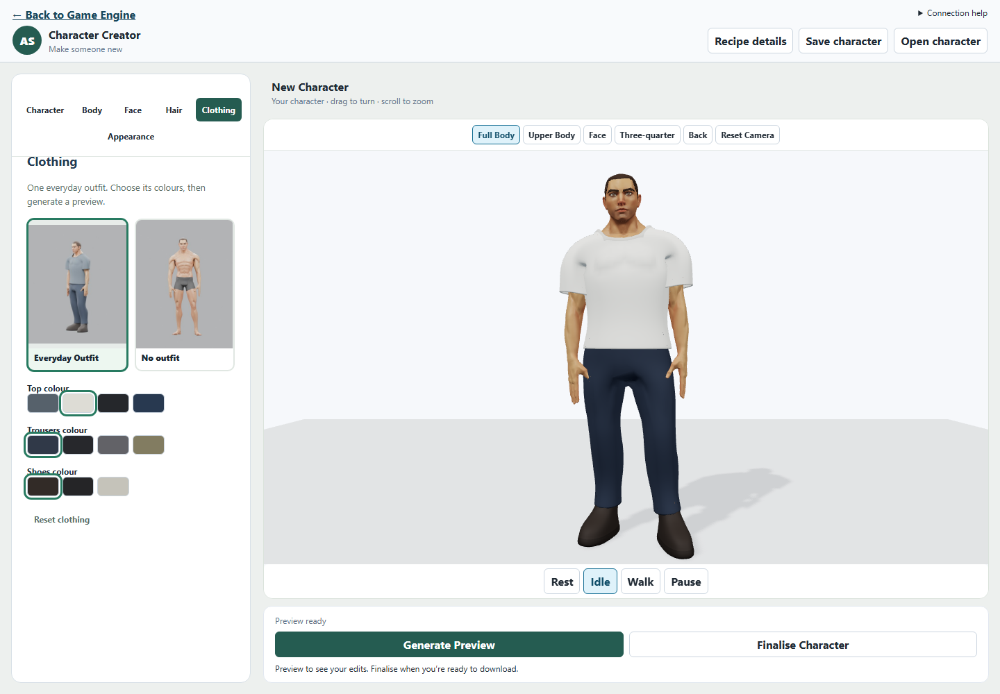
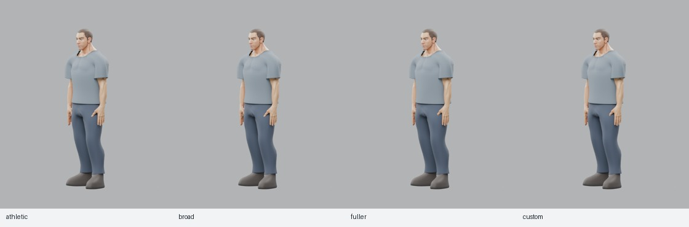

# Character Creator — First Outfit Result

6 October 2026 · Canonical Authored Human v1 · Everyday Outfit revision 1 · Blender 5.2.0 LTS.

## 1. Executive Result

**PASS — a user can create, preview, finalise, download and reopen a believable dressed character.**

New authored characters now wear the Everyday Outfit with short hair. Athletic,
Broad, Fuller and one moderate Custom build passed the selected fit checks.
The complete Game Engine → Asset Creator → Game Engine browser workflow passed.
This is one simple stylised outfit for the existing masculine base, with bounded
fitting and minor deep-pose creasing; it is not a wardrobe or universal tailoring system.

## 2. Outfit Design

A neutral crew-neck T-shirt with short sleeves; straight, slightly tapered
trousers; and simple ankle boots. The shirt hangs clear of the abdomen, trousers
have a sewn saddle/crotch and waistband, and boots have a shaped toe box, instep,
shaft and sole. No pockets, belt, laces, accessories or cloth simulation.

## 3. Clothing Architecture

The separate [editable source package](tools/blender-character/clothing/everyday-v1/README.md)
contains the three garment meshes, UV islands, weights and independent body-fit
targets. Its reproducible authoring script defines deliberate sewn panels;
product compilation appends the saved meshes rather than generating garments.

**Existing-work audit:** retain canonical triangle/barycentric correspondence,
bounded identity baking, Golden skinning and identical weights on both fabric
surfaces. Discard the old tank mesh and its narrow exposed armhole/shoulder
design. Earlier motion failures combined unequal inner/outer shell weights,
insufficient local clearance and uneven body-weight transfer onto an eased
garment. The tank study fixed paired weights but did not finish those boundaries.

This outfit uses new connected sleeve construction, garment-local shoulder
weight smoothing, reviewed cuff/knee/boot transitions and overlapping edges.
Morph deltas are transferred through canonical triangle correspondence, never
copied by garment vertex index. Each saved target starts independently at Basis.
Boot targets remain zero because the supported body morphs preserve the feet.

Garment-specific coverage lists store canonical body polygon IDs and the body
source hash. A complete outfit hides **4,760 of 12,566 body triangles**.
Only temporary compile meshes are masked; the canonical source remains untouched.
Visible neckline and sleeve boundaries retain skin margins. Shirt/waist and
trouser/boot overlaps cover their internal boundaries. Slot masks are separate.

## 4. Top

Pass at gameplay/conversation framing. The sewn shoulder panels and sleeves form
one continuous surface with an intentional collar, torso length and hem.
Nominal fabric thickness is 2.8 mm. Collar/cuff edge materials distinguish the
openings. The eased silhouette avoids following abdominal grooves.

Cloth-specific shoulder weight smoothing removed the sharp alternating folds
seen with unmodified transferred weights. Close raised-arm views retain local
armpit compression, without the old exposed armhole failure.

## 5. Trousers

Pass in the selected idle/walk, hip-flexion and deep-knee views.
The connected saddle seam separates the legs; the waistband overlaps the shirt,
and the full-length cuffs overlap the boot shafts. Nominal thickness is 2.8 mm.
A wider two-bone knee blend supports the cloth silhouette. Opposite-leg
influences are removed away from the central saddle. Deep bends retain creasing.

## 6. Footwear

Pass. The boots have a rounded toe, visible sole/welt profile and close ankle
shaft, with 3.5 mm shell thickness. Shaft weights transition from calf to foot
and ball toward the toe. The shaft follows the trouser cuff during motion.
The sole aligns with the canonical ground plane; the exported character retains
the existing uniform-height transform and unchanged Golden inverse binds.

## 7. Body Preset Compatibility

Values are mass / athletic / broadFrame; body and face presets are unchanged.

| Body | Values | Evidence |
| --- | --- | --- |
| Athletic | 0 / 0 / 0 | Exported round trip; all seven requested motion categories |
| Broad | 0 / 0.25 / 1 | Exported round trip; rest, idle and hardest raised-shoulder view |
| Fuller | 1 / 0 / 0.15 | Exported round trip; all seven motion categories; real browser finalisation |
| Custom | 0.5 / 0.4 / 0.4 | Exported round trip; idle and walk |

Clothing rejects combinations whose three body values sum above **1.65**.
The UI explains the limit and disables generation; the API/compiler also reject
it. No outfit retains the original body-control envelope. This conservative
bound is not a claim that every continuous combination has been visually sampled.

## 8. Motion Acceptance

| Motion | Result |
| --- | --- |
| Rest | Clean front/back garment silhouettes and overlaps |
| Idle | Sleeves, hem and cuffs remain attached and coherent |
| Walk | Continuous trouser legs; boots follow the existing gait |
| Clavicle-assisted raised arm | Continuous shirt; local compressed armpit folds remain |
| Approximately 115° elbow bend | Sleeves remain coherent above the elbow |
| Approximately 85° hip flexion | Connected seat/crotch; local compression accepted |
| Approximately 125° deep knee bend | No catastrophic knee collapse; boots remain attached |

Inspected actual GLB reimports, not only source scenes. Athletic and Fuller each
have eight complementary views. Broad has three views; Custom has two.
Golden idle/walk round trips sample five times per clip and validate independent
clones, restored rest state and finite deformed vertices.

[Athletic motion sheet](docs/assets/first-outfit/athletic-motion.jpg) ·
[Fuller motion sheet](docs/assets/first-outfit/fuller-motion.jpg)

## 9. Materials

Standard GLB PBR materials, zero metallic. Fabric roughness is 0.86; boot
roughness is 0.70. Each garment has a subtly darker edge/trim material using the
same chosen tint. UVs are saved in the source; no new texture payload is added.

| Part | Curated swatches |
| --- | --- |
| Top | Grey, White, Black, Navy |
| Trousers | Dark Blue, Black, Grey, Khaki |
| Shoes | Brown, Black, White |

Colour clicks edit the recipe and mark it dirty. They do not compile or create
a second preview material path. Generate Preview applies the chosen appearance.

## 10. Recipe Integration

CharacterRecipe remains V1 with optional `clothing`: `top`, `bottoms`,
`footwear`. Each is explicit `"none"` or a component ID, revision and colour.
The stable IDs are `everyday-top`, `everyday-bottoms`, `everyday-footwear`,
all revision `"1"`. Missing clothing preserves the older recipe's choices;
it does not silently add the new default.

The shared registry records project-authored source identity, compatibility,
Golden rig, source/authoring/mask hashes and provenance. The generated garment
art is original to this project; starting fit/weights derive from the existing
CC0 Quaternius body. Registry and output manifests retain those distinctions.

Request, compiler recipe, hashes, manifests, dirty checks and returned-result
validation all carry clothing. Saved JSON round trips preserve tints and none.

## 11. Creator UX

The authored family has a Clothing category with Everyday Outfit / No outfit
visual cards, selected states, swatches and Reset clothing. Its thumbnail shows
the actual compiled outfit. Clothing suggests Full Body framing while respecting
manual camera choices. No component IDs, revisions or fitting internals appear
in the normal controls. Legacy procedural controls remain unchanged.

The new dressed fixture is under
`public/assets/derived/authored-humans/everyday-v1/`; the original unclothed
canonical fixture is preserved.

## 12. Browser Workflow

**Passed:** Game Engine launcher → authored human → Athletic → Square face →
Short hair → Clothing → Everyday Outfit → White top → Generate Preview →
Full Body → Back → observed Walk motion → Fuller → Generate Preview →
inspect fit → Finalise Character → download GLB → save recipe → choose No outfit →
reopen saved recipe → outfit and White top restored → return to Game Engine.

The successful run made **two preview requests and one finalise request:
four Blender passes**. No colour-click compilation occurred.
Finalisation was deterministic and matched the Fuller preview's GLB hash.
No browser page errors were recorded. Earlier harness attempts exposed a server
reload, a hidden diagnostic-slider selector and an insufficient compile wait;
the successful case uses visible controls and a bounded longer response wait.

## 13. Runtime / Asset Cost

Measured local artifacts; timings are observations, not a performance benchmark.

| Metric | Unclothed authored human | Everyday outfit |
| --- | ---: | ---: |
| Triangles | 15,148 | 53,796 |
| Materials / rendered primitives | 4 / 4 | 10 / 10 |
| GLB bytes | 14,045,188 | 15,530,844 |
| Standalone preview | 6.77 s | 6.75 s |
| Standalone full finalisation | 13.38 s | 13.59 s |

The complete outfit adds 38,648 net triangles after masking, and about **1.49 MB
(10.6%)**. Most file bytes remain the existing body/hair textures. The geometry
cost comes from subdivided panels and real inner/outer shells, plus six garment
materials; it should be considered before using crowds of these characters.

In the successful real browser run, preview took **28.9 s / 27.7 s** and
finalisation **55.4 s**, with the browser renderer active on this machine.
No LODs or unrelated renderer optimisations were introduced.

## 14. Validation

- Clothing contract and recipe round-trip tests, including none, old recipes,
  malformed input, unsupported revisions and unsupported combined builds.
- API normalization and compilation-hash tests; source/provenance hash rejection.
- Saved-source checks for paired shell weights, at most four influences,
  normalized weights, independent bounded morph targets, UVs and coverage margins.
- Fresh four-body GLB round trips and selected motion renders.
- Two-build full determinism; preview/full binary equality.
- Installed dressed-fixture round-trip regression, including wrong-tint and
  missing-garment rejection.
- The single real browser workflow above.
- **CI: PASS — 79 Vitest files / 645 tests; root and Studio builds, all three workspace checks, and 55 Node compiler/animation tests.**
- **git diff --check: PASS.**

[Compact evidence and hashes](docs/assets/first-outfit/validation.json).
Full local logs and additional GLBs are in `test-results/first-outfit/`.
The checked-in dressed fixture retains its GLB, manifest, recipe snapshot,
diagnostics and build log.

## 15. Remaining Limitations

One outfit on the existing muscular masculine base. Close armpit/deep-knee
creases remain; very light cloth can show fine shadow speckles in the browser.
No cloth simulation, layering, garment weave textures or new animation clips.
The accepted samples do not exhaust continuous fit space. The 53.8k-triangle
asset has not been accepted as a crowd/mobile budget.

## 16. Next Recommendation

**Use character in game.** Prove the completed character as a player/NPC through
the existing asset-import and shared animation path before expanding the wardrobe.
This recommendation is not implemented by this pass.

