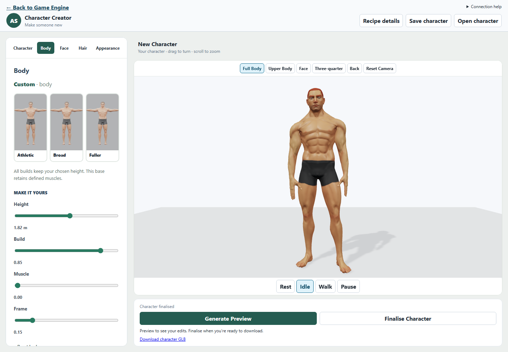
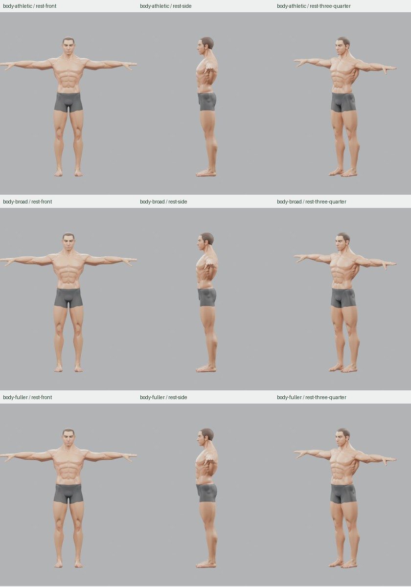
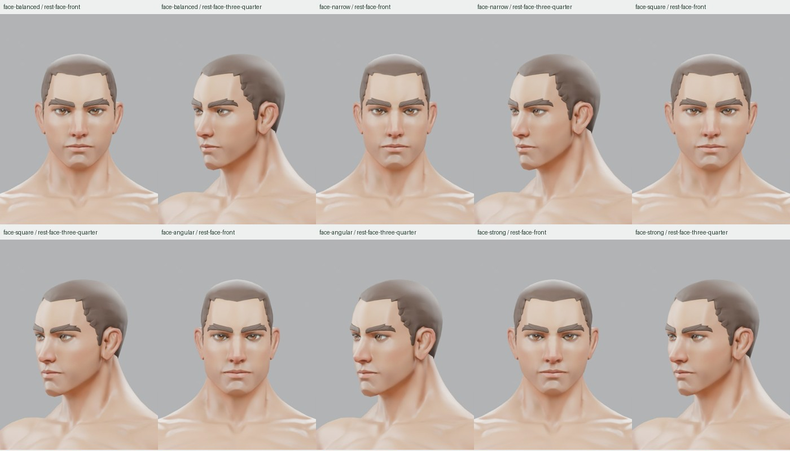
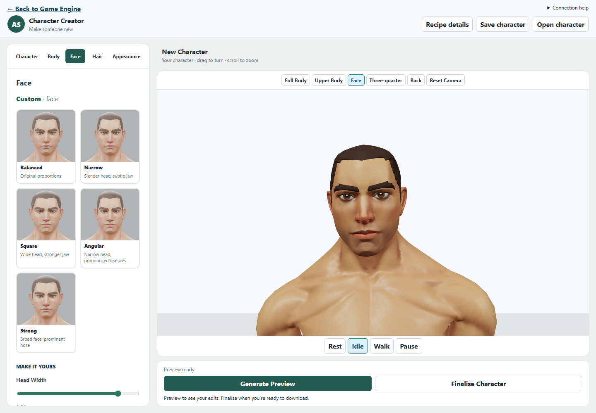
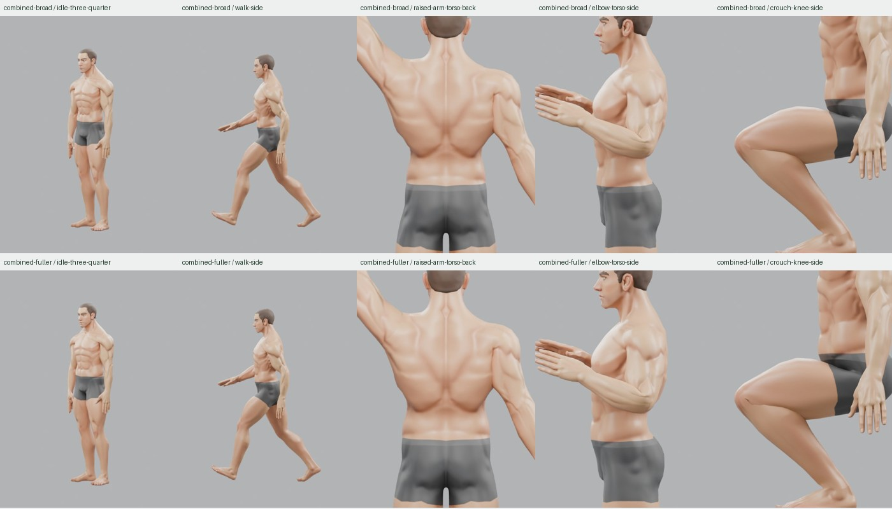

# Character Creator Product Pass Result

6 October 2026. Canonical authored human v1; Blender 5.2.0 LTS.

## 1. Executive Result

**PARTIAL — the creator experience is delivered; broad body diversity remains limited.**

The Asset Creator now reads and behaves like an initial character creator:
choose a body, choose a face, tweak, choose hair, preview and finalise. Categories,
real preset portraits, a dominant viewport and clear feedback replace the long
developer-oriented form. The complete real browser workflow passed.

Three body presets and five face presets are supported. They are curated vectors
of the existing accepted morphs, not newly sculpted anatomy. The bodies remain
variations of the muscular masculine source. This does **not** meet a broader
promise of six markedly different body types, or a universal human creator.
The honest strongest subset is shipped rather than labelling muscular variations
Slim, Average or Stocky. No foundation research or joint repair was restarted.

Browser workflow capture; the body card portraits were subsequently refreshed
to relaxed poses and inspected in the compact browser layout.

## 2. UX Before / After

The real app was opened and inspected before editing. At an 838-pixel window,
the old header consumed multiple rows, the long form hid most choices below the
fold, and camera/animation overlays obscured the small character. There were no
visual body/face presets, and edits before the first compilation showed “Ready.”

The header is compact; five categories expose one task at a time. Preset cards
use the actual compiled characters. The canvas is separated from its camera and
animation bars. “Changes not previewed” covers the initial fixture, imports and
generated results. Technical data stays behind Recipe details.

## 3. Creator Layout

Character, Body, Face, Hair and Appearance occupy a compact navigation area above
contextual controls in the left panel. The preview fills the remaining space.
Generate Preview and Finalise Character remain directly below it. Narrow screens
stack preview and controls. Save character/Open character preserve editable JSON;
the Game Engine return link stays visible. No dead Clothing category was added.

## 4. Body Archetypes

Values are `(mass, athletic, broadFrame)`; all presets preserve the chosen height.

| Preset | Values | Visual character | Accepted checks |
| --- | --- | --- | --- |
| Athletic | `(0, 0, 0)` | Original defined musculature and balanced frame | Fresh round trip, idle/walk samples, front/side/three-quarter |
| Broad | `(0, 0.25, 1)` | Wider upper ribs, shoulders and chest; modest change | Same checks, plus combined Square face and five targeted motion views |
| Fuller | `(1, 0, 0.15)` | Greater abdomen, oblique, hip and thigh volume; still muscular | Same checks, plus combined Angular face and five targeted motion views |

The accepted numeric envelope remains 0–1 for all three body dimensions. These
samples do not exhaust continuous combinations. No non-uniform bone scaling or
hidden height adjustment was added. Existing targets move surface landmarks by
millimetres to a few centimetres; they cannot credibly produce a slim/average
base or stocky limb proportions. Fuller is relative to this source, not an
obesity/body-fat system.

## 5. Body Fine Controls

Height: 1.50–2.10 m, with the existing whole-character scaling semantics.
Build, Muscle and Frame: 0–1, in 0.01 steps. Matching presets are highlighted;
changing their defining values shows Custom. Height is deliberately independent
of preset matching. Reset body resets these four controls and preserves the face,
hair and appearance.

## 6. Face Presets

Values are `(headWidth, jaw, nose)` on the unchanged canonical topology.

| Preset | Values | Difference |
| --- | --- | --- |
| Balanced | `(0, 0, 0)` | Original proportions |
| Narrow | `(-1, 0.15, 0)` | Narrower cranium with a restrained jaw |
| Square | `(1, 1, 0)` | Wider head and stronger jaw/chin |
| Angular | `(-0.65, 1, 1)` | Narrower head, pronounced jaw and nose |
| Strong | `(0.6, 0.4, 1)` | Broader face with more nose projection |

All five were freshly compiled and inspected front/three-quarter. Differences
are bounded identity variations, not a claim of five radically different facial
anatomies. Original eyelids, eyes, brows, lips, ears, hairline and neck remain
coherent in the selected views. No new facial dimension was introduced.

## 7. Face Fine Controls

Head Width: −1–1. Jaw / Chin and Nose: 0–1. Each is editable after a preset, with
Custom shown when values cease to match. Reset face affects only those values.
The fine controls remain below the visual choices rather than leading the page.

## 8. Hair

Short hair and No hair are visual cards. Brown, Black, Blond, Auburn and Silver
swatches accompany a custom colour input. The colour also affects brows, which
the UI states. Fresh short-hair checks include every face and both combined
cases; a fresh no-hair build and front/three-quarter renders also passed.
No additional hairstyle or hair-fitting system was added.

## 9. Appearance

Original, Warm, Muted and Deep tint swatches plus a custom tint retain the existing
texture multiplication. Skin finish exposes the existing 0.2–1 roughness range
as Satin → Matte. The UI explicitly says the tint also affects painted shorts.
There is no separate skin mask in this source, so this is not presented as a
finished skin-tone system. Unsupported eye colour remains hidden.

## 10. Viewport / Cameras

Full Body, Upper Body, Face, Three-quarter, Back and Reset Camera are available.
Body suggests full-body framing; Face/Hair suggest face framing; Appearance
suggests upper-body framing. Once the user orbits, zooms or explicitly chooses a
camera, category changes respect that choice. Recompilation retains its position
and target. Reset Camera returns to the default and re-enables category framing.

Framing fits the character and the viewport aspect ratio. The construction grid
is hidden for authored humans; the neutral background, lit character, floor and
shadow remain. Camera and motion controls sit outside the canvas. Idle/walk and
pause still work. During compilation, the current pose holds and rendering is
limited to 10 Hz, leaving orbit available while reducing resource competition.

## 11. Preview / Finalise UX

Editing sends no compile request. Dirty feedback distinguishes the visible
compiled character from the controls, including before the first generated
preview and after reopening saved values. Generate Preview performs one Blender
build and GLB round trip. Finalise Character retains two builds, both round trips
and determinism checks; its download link appears only for the matching full
result. Failures preserve the previous preview and expose technical details.

Instant morph preview was not introduced: the served GLB bakes identity and
contains no usable identity targets. A second local deformation implementation
would not be the compiler's canonical source. The explicit workflow remains
honest and deterministic.

## 12. Recipe / Persistence

CharacterRecipe V1, geometry family, canonical revision and Golden rig profile are
unchanged. Presets store no new IDs: choosing one writes resolved numeric values.
Updating a preset table later cannot reinterpret a saved character. Matching is
derived from values when reopening; an old vector may simply show Custom.

Body and face choices preserve unrelated values. Section resets are scoped;
Reset character has an immediate Undo character reset action. Recent results
restore their captured recipe and artifact together, remain session-only, and
are available in Character. Opening another recipe clears stale reset undo.
Legacy recipes keep their family and compile semantics. No library, assignment
or automatic legacy migration was added.

## 13. Visual Acceptance

Eleven selected fresh preview builds passed exported validation and shared clone/
rest checks. Thirty-one selected views cover nine body views, ten face views,
two no-hair views and ten motion views. Three additional idle/front body portraits
replace T-pose thumbnails in the UI. Only this compact selection was rendered.
Body differences are modest; the reference sheets intentionally make that clear.

The art source hash remains
`7773ca3ee38eeb5ff168783d8753b7adb49c79499f273b050cd105f75763a63d`.
No source geometry, weights, UVs, rig or compiler semantics changed.

## 14. Motion Acceptance

Broad + Square and Fuller + Angular were inspected in idle, walk,
clavicle-assisted raised arm, approximately 115° elbow bend and approximately
125° knee bend. Both remain acceptable at gameplay/conversation framing.
Existing inner elbow/knee creases and armpit compression remain visible; no
new break, hair detachment or gross collapse was observed. The deep-knee sample
is a diagnostic pose, not a grounded squat animation. Exported idle/walk checks
sample five times per clip for every build.

## 15. Browser Workflow

The existing single `@canonical-human` Playwright case was extended and passed:
Game Engine → Asset Creator → canonical load → camera/orbit/zoom → Body → Fuller
→ Build 0.85 → dirty feedback → Generate Preview → Full Body → Face → Square
→ Head Width 0.7 → Generate Preview → retained Face camera → No hair/Short hair
→ Auburn → Finalise Character → download availability → Back to Game Engine.
Exactly three compile requests were made. Edits alone sent none. No browser page
errors occurred. Manual framing survived category navigation and compilation.

The successful automated run measured 4.87 s to initial load, 1.29 s for the
preset click/selection, 25.49 s for body preview, 19.06 s for face preview and
55.12 s for finalisation. These include browser automation/response overhead on
this Windows headless run; they are not interactive frame-rate measurements.
Separate preset build + extra clone-validation samples took 8.46–13.91 s each.
These timings are slower than the previous report's context figures, so no
overall performance improvement is claimed. A first workflow run exceeded its
old three-minute budget; the expanded three-request case uses five minutes and
completed in 2.6 minutes after compilation-time preview throttling.

## 16. Validation

- Fifteen preset combinations round-trip through recipe serialization/parsing,
  with exact numeric values and selection/custom matching.
- Creator component coverage checks navigation, presets, unrelated-value
  preservation, scoped resets, reset undo, imports, dirty feedback, captured
  requests, failure preservation and recent-result restoration.
- Eleven selected real authored builds passed their round trips, unchanged
  topology/UV correspondence for haired cases, and shared clone/rest checks.
- The real browser finalisation passed determinism and download availability.
- `npm.cmd run ci` was invoked once: **78 test files / 642 tests passed**, followed
  by the root production build and all three package builds/typechecks. Studio's
  typecheck caught an unsupported `exact` option in one Testing Library query.
  Removing that test-only option resolved the error. The affected Studio build
  then passed, followed by all **52 Node compiler/animation checks** that the
  original CI command had not reached. The full CI command was not repeated.
- `git diff --check`: passed. Final layout simplification and refreshed body-card
  portraits were also inspected in the real browser after the workflow run.

Two early component timeouts occurred while the render workload was active.
Narrowing the recent-result test's repeated full-page queries preserved its
assertions and brought the isolated test to 2.8 seconds. A browser exact-text
locator initially missed the combined “Custom · body” text; the label now has
its own element. Neither failure was a compiler or geometry failure.

## 17. Remaining Limitations

One muscular masculine base; limited body/face variation; two hairstyles; tint
also colours painted shorts; generation remains explicit and can be slow on
this machine. Thumbnails show starting-point colours, not a live edited draft.
Deep-bend creases remain. Responsive layout was reviewed at desktop and compact
window widths, not through a device matrix. No clothing, character library,
player/NPC assignment or other deferred system was implemented.

## 18. Recommended Next Feature

**Clothing.** A small, validated everyday outfit will most directly turn these
characters into usable action-adventure people and remove reliance on painted
shorts. Keep its scope to the established authored fitting route. It has not
been implemented in this pass.
