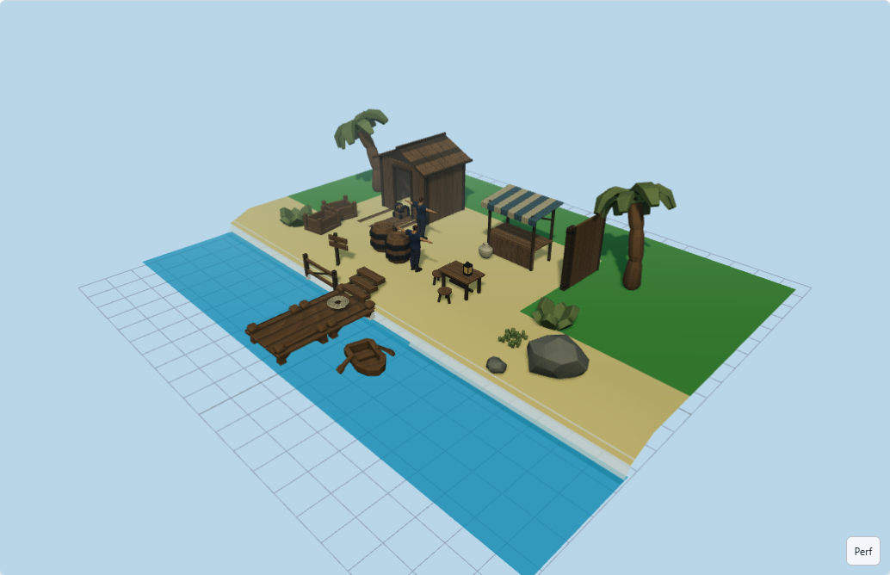
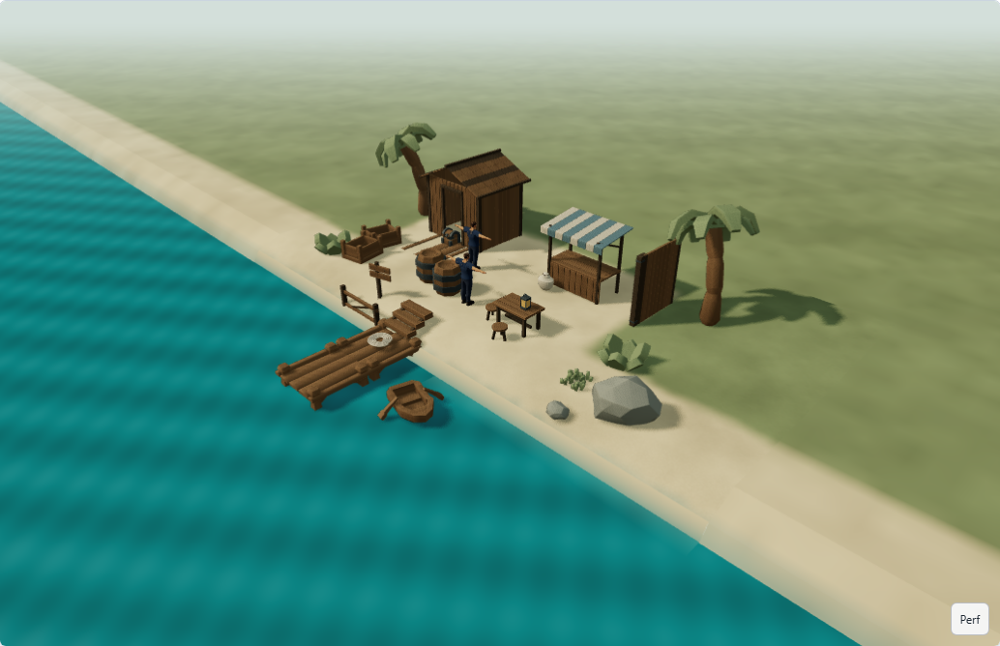
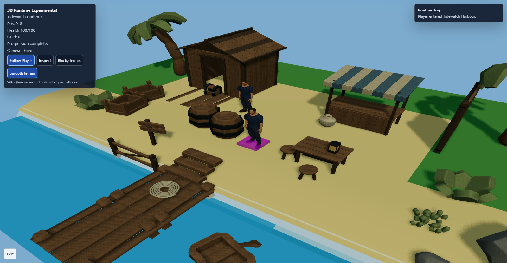
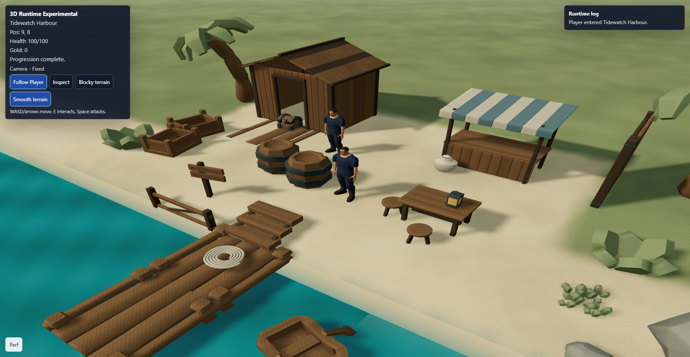

# Environment & Visual Quality Pass — Tidewatch Harbour

## 1. Executive Result

**PASS for visual and functional acceptance.** Tidewatch Harbour is materially closer to a polished stylised action-adventure environment: quieter ground colours, blended grass/sand, a continuous coast, readable timber and character lighting, and grounded shadows. The comparison uses the same project, object placements and camera framing.

**Performance qualification:** the local headless browser is slow before and after. The measured cost of the new presentation is recorded below; this is not a claim of smooth hardware-accelerated play.

## 2. Before-State Diagnosis

Fresh Edit and Play captures showed saturated, uniform ground; cyan water; a pale hard shoreline band; dark timber and characters; exposed rectangular map edges; and an editor grid showing through the water. The existing sky dome was clipped by the editor camera, and its custom shader omitted output colour conversion. A magenta spawn helper appeared beneath the player in Play.

## 3. Final Visual Direction

Warm coastal daylight, olive grass, warm neutral sand, weathered timber and teal water. Keep the existing silhouettes and lightweight geometry. Use directional shadows for grounding and distant haze for separation, while keeping the harbour itself clear.

## 4. Lighting

Both adapters use the same existing clear-day preset. The sun moves to −38° azimuth / 42° elevation, with warm light at intensity 2.5. Hemisphere intensity is 1.5, with a cooler sky and neutral warm ground contribution. This lifts character and wood detail without erasing directional contrast. Other atmosphere presets remain available.

## 5. Shadows

Retained the supported PCF filter and 1024² directional shadow map. Radius is 2.5, normal bias .012 and depth bias −.00015; the shadow camera far plane is 120. The existing player/NPC and prop shadow roles remain authoritative. Smooth water now receives dock/boat shadows. Distant backdrop surfaces skip shadow sampling outside the playable area. No AO or post-processing dependency was added.

## 6. Sky / Atmosphere

The existing gradient sky now stays camera-centred at the far plane and performs explicit sRGB output conversion. The editor can render it with its existing clipping range. A pale warm horizon blends towards a cooler upper sky. Clear-day haze starts at 24 world units and reaches the horizon colour at 80. No weather, HDRI downloads or authored lighting system.

## 7. Water

The shared Standard material uses deeper teal, .30 roughness and approximately .94 opacity. Small world-space colour/normal ripples update through the existing animation loop, with no mesh displacement or physics. Existing shallow-water strips now fade at their outer edge instead of ending in a hard band. Specular ripple visibility depends on the viewing angle; this is not reflective water.

## 8. Ground / Shoreline

Grass and sand use a deterministic, subtly mottled colour texture generated from existing tile identities. Grass/sand borders interpolate over a narrow, irregular transition. Texture size is capped at 1024² for the playable surface and 512² for the distant backdrop. The existing bank geometry now has opaque damp-sand shading so the background cannot show through beneath the shore. The shallow strip extends .85 units into water and fades to zero opacity.

This is presentation over the existing terrain mesh: no new terrain schema, sculpting, displacement, paint layers or gameplay semantics.

## 9. World Edge

A non-pickable visual apron continues the existing perimeter ground and water into haze. It is limited to complete, flat outdoor borders; sparse maps, interiors and authored elevations retain their existing edges. Small bank skirts close the land/water gap outside the map. The map remains **20 × 15** and movement boundaries are unchanged. The editor grid appears while terrain tools are active.

## 10. Materials

The same material families remain: weathered/structural wood, iron, stone, canvas, blue canvas and foliage. Renderer-side copies adjust roughness, lift iron/stone/canvas, and balance foliage with the ground. Stable asset/instance identifiers produce a restrained ±3% tint variation. Materials are shared within each prepared asset instance and explicitly disposed when its scene ends; cached source materials, geometry and textures remain untouched.

## 11. Asset Presentation

Palms, bushes and grass use quieter, more coherent foliage colours. Rocks have a lighter neutral response; iron is less black without an environment map. No meshes were remodelled. All **23 registry IDs, GLBs, source files and thumbnails remain unchanged**, including the existing authored character. Faceted silhouettes remain part of the kit's style.

## 12. Character Integration

The authored player and Harbour Keeper remain the visual scale reference. Both load through the existing cached GLTF/skeleton/animation path, with two active character mixers in Play. Their materials and art are unchanged. The new lighting makes clothing and faces easier to read. Spawn helpers remain in Edit and are omitted from Play's marker-only copy; spawning, saved event blocks and gameplay state are preserved.

## 13. Camera / Colour Management

Retained the editor's 50° FOV, runtime's 55° FOV and the sample's authored camera settings for a direct comparison. Existing orbit, low-angle, follow and third-person controls are unchanged. ACES filmic tone mapping and sRGB output remain enabled at clear-day exposure 1.05. Corrected the custom sky's colour path rather than introducing a post-processing stack.

## 14. Performance Observation

| Short headless observation | Before | After |
| --- | ---: | ---: |
| Editor reported FPS | 4.0 | 3.0 |
| Editor average frame interval | 218.4 ms | 311.3 ms |
| Play reported FPS | 2.2 | 1.5 |
| Play average frame interval | 519.7 ms | 667.2 ms |
| Editor / Play draw calls | 115 / 106 | 116 / 106 |
| Editor / Play triangles | 145,876 / 145,870 | 146,580 / 146,560 |

**The sampled frame intervals are slower, so this pass does not claim performance neutrality.** These short headless windows include startup/settling and have different averaging windows from the rolling FPS reading. They are rough observations, not a hardware benchmark. Browser camera controls, movement and save/reload completed without errors or stalls that prevented interaction. The user's hardware-accelerated interactive performance remains unverified.

The initial visual iteration exposed unnecessary double-sided transparent shore draws and shadow sampling on the distant apron. The final implementation removes those costs and halves backdrop texture resolution. No general optimisation, LODs or character simplification was attempted.

## 15. Browser Workflow

One opt-in case imports the checked-in Tidewatch JSON through Import JSON, opens 3D View, waits for all 32 imported instances, captures Edit, checks the low-angle sky view, enters Play, verifies two active character mixers, moves the player from 9,8 to 9,9, returns to Edit, saves and reloads. It checks complete saved-project equality, successful asset loads and absence of browser/shader errors.

The sample JSON and all placements are unchanged. Source SHA-256: `8cf104b9e7d786b7890a3492a90b14bf9308c77f84366e09388c1ade46e6067b`. Fresh baseline source commit: `a0370a7f06b377d6946c3f6964a91b474b45a9cc`.

Reproduce from the repository root:

```powershell
node node_modules/@playwright/test/cli.js test e2e/environment-visual-quality.spec.ts --grep '@environment-visual' --list
node node_modules/@playwright/test/cli.js test e2e/environment-visual-quality.spec.ts --grep '@environment-visual' --output=test-results/environment-final
```

`VISUAL_PHASE=before` was used on the original renderer before implementation. Do not overwrite that baseline with the updated renderer. This case is excluded from the default integration selection.

## 16. Before / After Evidence

Both runs use the same 1600 × 1000 browser viewport. Screenshots are direct browser captures; the editor capture is cropped to its viewport. No image retouching or scene rearrangement.

| View | Before | After |
| --- | --- | --- |
| Editor, default camera |  |  |
| Play, authored fixed camera at spawn |  |  |

[Additional low-angle coast/sky view](docs/assets/environment-visual/after/coastal-sky.png). Raw diagnostics: [before](docs/assets/environment-visual/before/observations.json), [after](docs/assets/environment-visual/after/observations.json).

## 17. Validation

- Focused renderer/material/environment/water tests, kit GLB compatibility round trips and mounted editor tests pass. Added checks cover deterministic texture/tint variation, UV continuity, presentation-only border geometry, disposal, cached-source preservation, character material exclusion, and fading shore attributes.
- Fresh baseline passed in 1.4 minutes. Final browser run passed in 2.3 minutes, including the additional low-angle capture and movement assertion. All 32 instances loaded; two character mixers were active; no browser/shader errors or failed asset responses; complete saved-project equality before and after Play/reload.
- Required CI ran **once**, after the browser closed: 632 tests passed and 35 failed in two suites because their renderer mocks/palette expectations needed the corresponding updates. After those focused corrections, both affected suites passed **52/52**, accounting for **all 667 Vitest tests in 87 files**. The full CI command was not repeated.
- All remaining CI stages passed when run directly after that recheck: root type-safe production build, both contract builds, shared Three preview build, Asset Studio type-safe production build, and **63/63 Node compiler/asset/provenance checks**. Existing production bundle-size warnings remain.
- `git diff --check`: passed. Logs: `test-results/environment-ci.log`, `environment-ci-recheck.log`, `environment-builds.log`, and `environment-compiler.log`.
- No Blender character matrices, broad screenshot suites or asset recompilation.

## 18. Remaining Limitations

- The authored shoreline and background extension still follow the grid; this is a material/presentation improvement, not a natural coastline modeller.
- The distant apron is visual only. Elevated or incomplete borders retain their original edge presentation.
- Water has no reflections or depth buffer effects. Ripple visibility varies by angle.
- Foliage and rocks retain low-poly facets. No geometry or character-art changes.
- Headless performance is poor and does not establish the user's interactive GPU performance.
- Terrain height, docks and steps remain presentation-only; mesh traversal is not implemented.

## 19. Recommended Next Feature

**Collision/traversal improvement.** The dock, steps and shack now read as places to explore; shared height-aware movement and clear traversal boundaries would make their behaviour match their appearance. Keep that work in the shared gameplay layer described by the roadmap. It is not implemented by this pass.
