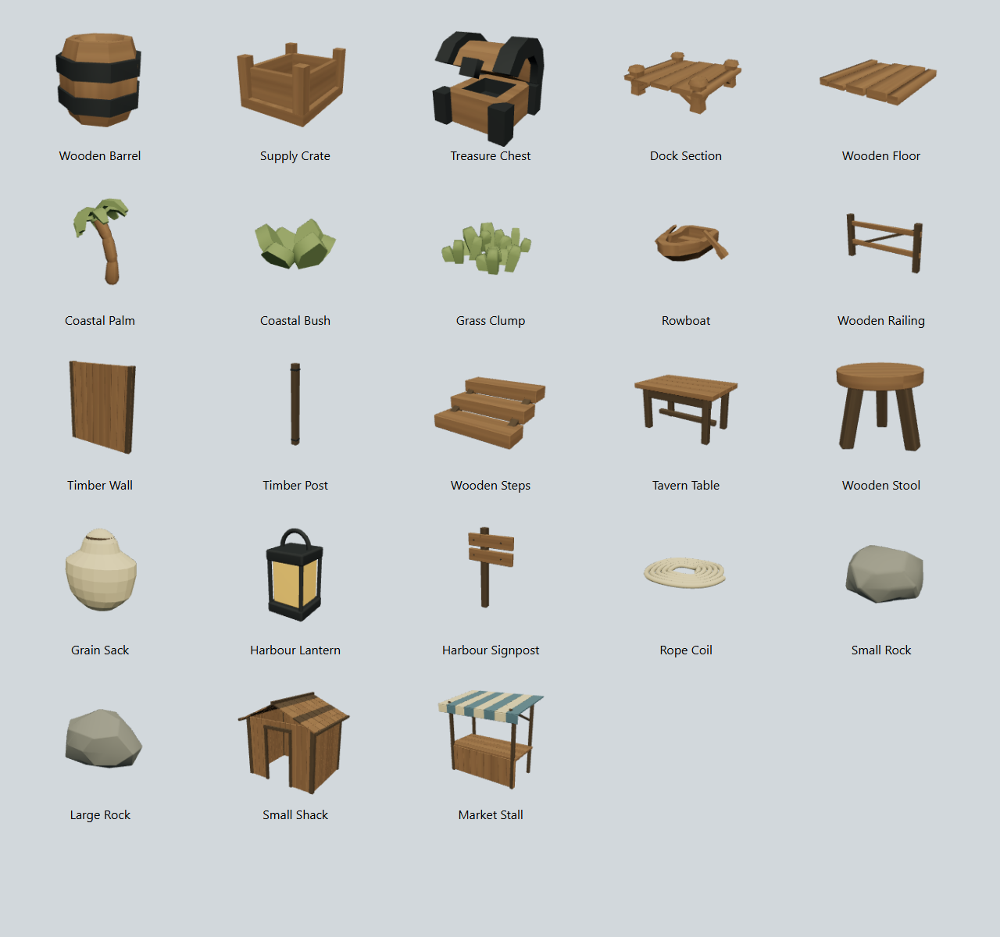
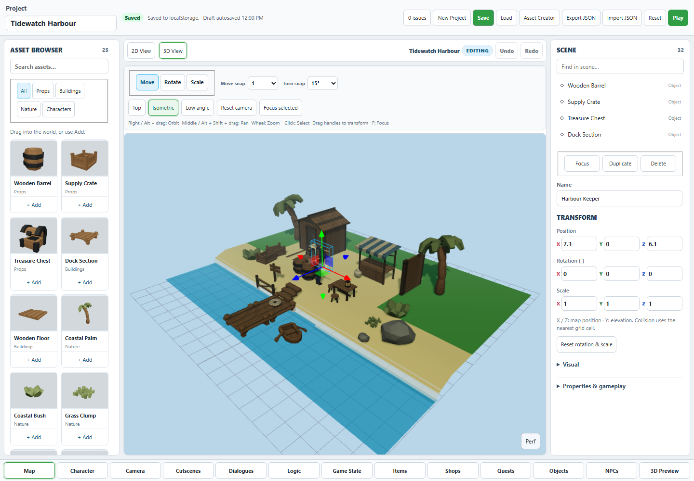
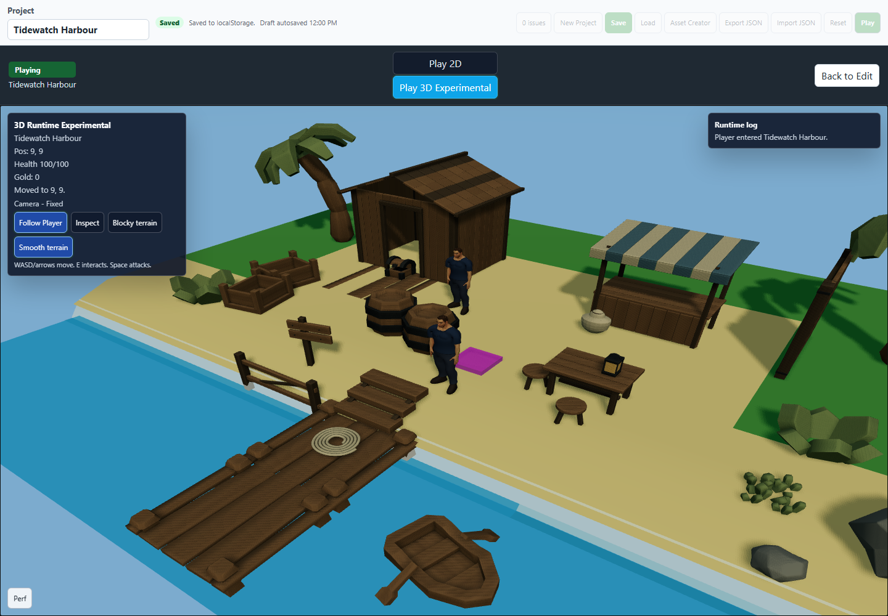

# World Asset Library Pass — Result

## 1. Executive Result

**PASS — the user can build a coherent small adventure environment using the real Map Editor.** The final browser workflow passed through all 23 assets, a 30-object harbour, character placement/assignment, Play, save and reload. The saved project remained identical.

**Performance qualification:** the local headless run was slow: 3.7 FPS in Edit and 2.0 FPS in Play with two authored humans. Functional acceptance is green; smooth rendering on this machine is not established. No renderer optimization project was attempted.

The existing Map Editor now exposes a curated **23-piece Tidewatch Harbour kit**: nine adapted repository meshes and fourteen project-authored pieces. All use stable registry IDs, real GLBs, shared muted materials and rendered thumbnails. No project defaults are populated or rewritten.

## 2. Baseline Repair

The clothing registry was authoritative. The authoring script writes compact JSON without a terminal newline. Compact serialization of the committed coverage data reproduces the accepted SHA-256 **b63b6d9efebc61af94c7aceefc5a412625616eeec0128ae248841ff35016da47** exactly, matching both the registry and accepted first-outfit evidence. The committed pretty-printed LF representation hashed to **d17cda43999fb87339f6b8523b4131d663e7a7afb8a57bd21ee4a0f5beb7b9d7**; the CRLF checkout differed again. The mask values, topology binding and garment art were unchanged. Restored the original serialization; did not change any expected hash or regenerate clothing.

Biome now excludes this byte-hashed generated file and Git preserves its bytes. The first compiler run also exposed five vendor hair GLTFs whose Windows CRLF checkout differed from their accepted committed LF bytes. Restored their exact committed bytes and pinned LF. The clothing authoring/provenance/licence text hashes were originally recorded with CRLF; those checkout endings are explicitly pinned as well. Validation remains strict byte comparison.

The initial full cheap compiler run accounted for 58 passing tests and five line-ending failures. The focused clothing, component-registry, API and compiler-workflow rerun passed all 16 tests after correction. Final full CI status is recorded in section 16.

## 3. Existing Asset Audit

The pirate directory contained a systematic filename/content mismatch: barrel.glb was a 512 × 512 PNG; crate.glb held a chest; chest.glb held a castle window tower; rocks-a.glb held planks; structure.glb held a wreck. A full rendered contact sheet and internal node identities established actual contents before selection.

- **Ready:** the already finalised authored character; retained byte-for-byte as scale reference.
- **Usable after cleanup:** barrel, supply crate, chest, dock, floor, palm, bush, grass and rowboat geometry. Replaced bright palette materials, regenerated usable UVs, fitted scale, grounded origins, and removed prop animation actions. Copied the misnamed existing PNG unchanged to the legacy models' expected texture path.
- **Placeholder/test-only:** Demo Box and engineering character fixtures stay resolvable but are hidden from the normal library. Existing project-owned definitions remain available.
- **Unsuitable for this kit:** exaggerated column rocks, castle towers, huge ships/wrecks and redundant variants. Retained their files/IDs for compatibility; no destructive purge.

The [bounded original-file audit](docs/assets/world-kit/existing-asset-audit.json) records each pirate file's actual first node and disposition. Source hashes and exact reused paths live in the [kit manifest](public/assets/world-kit/manifest.json). No external asset pack was downloaded. Kenney's [official Pirate Kit page](https://kenney.nl/assets/pirate-kit) identifies the source as CC0; see [provenance](public/assets/world-kit/PROVENANCE.md).

## 4. Visual Direction

Muted coastal adventure: warm weathered timber, darker structural wood, dark iron, olive foliage, neutral stone and cream/blue canvas. Recognizable silhouettes and restrained proportions connect the lightweight repository art with the human character. Deliberately faceted foliage remains stylised; the kit does not aim at photorealism.

## 5. Scale Convention

**One Three world unit / grid cell is one metre.** New assets place at registry scale 1; authored instance scale starts at 1. The existing character is 1.82 m. Barrel 1 m; crate .70 m; table .775 m; stool .44 m; walls/posts 2.4 m; shack door about 1.0 m wide × 2.1 m clear; shack ridge 3.15 m; stairs .18 m rise/.35 m tread; dock approximately 2 × 2 m with .65 m height; floor approximately 2 × 2 m; palm 3.8 m. Exact GLB bounds follow.

## 6. Final Asset Set

Dimensions are X × Y (height) × Z, measured from the exported GLBs. Material names refer to the shared family; wood embeds the small reusable textures.

| Name | Category | Source | Triangles | Materials | Thumbnail | Dimensions / notes |
| --- | --- | --- | ---: | --- | --- | --- |
| Wooden Barrel | Props | Repo / Kenney CC0 | 188 | weathered-wood, iron | [PNG](public/assets/world-kit/thumbnails/barrel.png) | 1.09 × 1.00 × 1.09 m |
| Supply Crate | Props | Repo / Kenney CC0 | 76 | weathered-wood | [PNG](public/assets/world-kit/thumbnails/crate.png) | 0.98 × 0.70 × 1.19 m |
| Treasure Chest | Props | Repo / Kenney CC0 | 246 | weathered-wood, iron | [PNG](public/assets/world-kit/thumbnails/chest.png) | 0.53 × 0.56 × 0.55 m |
| Dock Section | Buildings | Repo / Kenney CC0 | 324 | weathered-wood | [PNG](public/assets/world-kit/thumbnails/dock.png) | 2.00 × 0.65 × 2.01 m |
| Wooden Floor | Buildings | Repo / Kenney CC0 | 60 | weathered-wood | [PNG](public/assets/world-kit/thumbnails/floor.png) | 1.97 × 0.18 × 1.98 m |
| Coastal Palm | Nature | Repo / Kenney CC0 | 482 | weathered-wood, leaf-light | [PNG](public/assets/world-kit/thumbnails/palm.png) | 2.57 × 3.80 × 2.87 m |
| Coastal Bush | Nature | Repo / Kenney CC0 | 144 | leaf-light | [PNG](public/assets/world-kit/thumbnails/bush.png) | 1.39 × 0.65 × 1.55 m |
| Grass Clump | Nature | Repo / Kenney CC0 | 360 | leaf-light | [PNG](public/assets/world-kit/thumbnails/grass.png) | 0.84 × 0.30 × 0.81 m |
| Rowboat | Props | Repo / Kenney CC0 | 206 | weathered-wood | [PNG](public/assets/world-kit/thumbnails/rowboat.png) | 1.95 × 0.60 × 1.68 m |
| Wooden Railing | Buildings | Project-authored | 540 | structural-wood, weathered-wood | [PNG](public/assets/world-kit/thumbnails/railing.png) | 2.00 × 1.10 × 0.15 m |
| Timber Wall | Buildings | Project-authored | 1,512 | structural-wood, weathered-wood | [PNG](public/assets/world-kit/thumbnails/wall.png) | 2.00 × 2.40 × 0.18 m |
| Timber Post | Buildings | Project-authored | 324 | iron, structural-wood | [PNG](public/assets/world-kit/thumbnails/post.png) | 0.20 × 2.40 × 0.20 m |
| Wooden Steps | Buildings | Project-authored | 540 | structural-wood, weathered-wood | [PNG](public/assets/world-kit/thumbnails/stairs.png) | 1.20 × 0.54 × 1.05 m |
| Tavern Table | Props | Project-authored | 1,188 | structural-wood, weathered-wood | [PNG](public/assets/world-kit/thumbnails/table.png) | 1.40 × 0.78 × 0.89 m |
| Wooden Stool | Props | Project-authored | 608 | structural-wood, weathered-wood | [PNG](public/assets/world-kit/thumbnails/stool.png) | 0.49 × 0.44 × 0.48 m |
| Grain Sack | Props | Project-authored | 1,464 | structural-wood, canvas | [PNG](public/assets/world-kit/thumbnails/sack.png) | 0.60 × 0.68 × 0.48 m |
| Harbour Lantern | Props | Project-authored | 1,012 | iron, lantern-glass | [PNG](public/assets/world-kit/thumbnails/lantern.png) | 0.24 × 0.50 × 0.24 m |
| Harbour Signpost | Props | Project-authored | 1,204 | iron, structural-wood, weathered-wood | [PNG](public/assets/world-kit/thumbnails/sign.png) | 0.85 × 1.44 × 0.14 m |
| Rope Coil | Props | Project-authored | 4,800 | canvas | [PNG](public/assets/world-kit/thumbnails/rope.png) | 0.80 × 0.06 × 0.77 m |
| Small Rock | Nature | Project-authored | 344 | stone | [PNG](public/assets/world-kit/thumbnails/rock-small.png) | 0.65 × 0.37 × 0.59 m |
| Large Rock | Nature | Project-authored | 352 | stone | [PNG](public/assets/world-kit/thumbnails/rock-large.png) | 1.83 × 1.17 × 1.31 m |
| Small Shack | Buildings | Project-authored | 15,336 | structural-wood, weathered-wood | [PNG](public/assets/world-kit/thumbnails/shack.png) | 3.39 × 3.15 × 2.86 m |
| Market Stall | Buildings | Project-authored | 3,888 | structural-wood, weathered-wood, canvas, canvas-blue | [PNG](public/assets/world-kit/thumbnails/stall.png) | 2.56 × 2.38 × 1.64 m |

The complete kit totals **35,198 triangles and 1.79 MiB of GLBs**. The shack is the largest piece at 15,336 triangles, primarily softened planks/shingles. Rope is 4,800 triangles; ordinary props are much cheaper. No 200k-triangle imports.

## 7. Props

Distinct storage pieces, plausible furniture, a tied sack, framed lantern, signpost, coil and rowboat cover practical harbour dressing. New timber has softened edges; the sack has a shaped neck and ties; lantern has a handle and iron frame. The chest is a static open chest. No new container or light behavior is implied by its visual.

## 8. Buildings / Environment

A small timber shack and canvas market stall provide recognizable structures. Floor, dock, steps, railing, wall and post support a modest composition without introducing a prefab or architectural assembly system. The shack has a real doorway opening, but gameplay interior/collision authoring remains existing grid semantics.

## 9. Nature

The compact set comprises a coastal palm, bush, grass and two deliberately different rock silhouettes. Existing foliage meshes were reused with muted materials. No vegetation generator or wind system.

## 10. Materials / Textures

Ten shared material definitions: weathered wood, structural wood, cut wood, iron, stone, canvas, blue canvas, leaf, light leaf and amber glass (only used definitions are exported per asset). Two original 128 × 128 wood grain textures; other surfaces use PBR factors. Wood/canvas/stone/foliage roughness is .86–.97; iron .62 roughness/.55 metallic. GLBs embed textures, eliminating relative-path dependencies for the kit.

Original authoring and texture source: [author.py](tools/world-kit/author.py), separate from compiled output. Reused geometry is Kenney CC0, permitting commercial use, modification and redistribution. Project-authored additions carry the owner's use/modification/redistribution statement in [provenance](public/assets/world-kit/PROVENANCE.md). No shader system was added.

## 11. Registry / Asset Browser

All 23 entries are in the existing Three visual registry with world-* stable IDs, readable names, restrained tags, runtime paths and thumbnail references. Optional browser category/thumbnail/visibility metadata is additive to the existing asset contract, not a second catalogue or saved-project schema.

Categories and tags survive creation of ordinary object definitions; a placed Shack stays in Buildings and retains its search tags after reload. Legacy raw assets remain loadable and explicitly assignable, while inaccurate/test entries are hidden from general browsing. Existing authored definitions are never deleted. The existing built-in Small House remains a separate structure option.

The shared cached GLTF pipeline renders 256 × 192 neutral-background, three-quarter thumbnails. Shipped images let the browser show the kit without eagerly loading every GLB. Imported character thumbnails continue using the same live cached path. No Map Editor redesign.

## 12. Placement Quality

Exported geometry has identity transforms and bottom-centre origins; palm uses its trunk base. Fresh GLTF round trips check finite bounds, ground Y=0, footprint centring, dimensions, normals, UVs, triangles, embedded image references and stable provenance. Each new asset uses the same marker renderer and instance transforms in Edit and Play.

Browser acceptance is recorded below. Raised docks/steps remain visual geometry; walking height is not inferred from meshes.

## 13. Demonstration Scene

**Tidewatch Harbour** contains 30 placed objects, the Harbour Keeper NPC and the same finalised authored asset assigned as the player. A shack, striped market stall, connected dock sections, landing steps, moored rowboat, crates/barrels, table/stools/lantern, rail, sign and coastal foliage form a recognizable outpost. The existing spawn marker remains visible in Play.

Every kit piece was placed by native browser drag, selected, positioned, rotated, duplicated and deleted/reselected through real controls. Seven lasting duplicates dress the scene. The authored character was added from Characters and assigned through the existing Character tab. Character art was unchanged. Door height, furniture, barrels and tree proportions were inspected together in the screenshots.

**Try it:** use **Import JSON** and select [Tidewatch Harbour](docs/assets/world-kit/tidewatch-harbour.project.json), then **3D View → Play**. This is the exact ordinary project JSON exported by the accepted browser workflow. It references the existing bundled kit and finalised character folders. No sample system or default-project mutation.

[Reloaded scene evidence](docs/assets/world-kit/harbour-reloaded.png). All four images were visually inspected; no clipping/missing textures, floating origins or obvious material-family mismatch was seen.

## 14. Runtime / Performance Sanity

The accepted run rendered **32 imported instances**: 30 world objects plus player/NPC instances of one character asset. Before the explicit page reload, each of the 23 kit GLBs was requested **once**, despite duplication, deletion, returning from the Character tab and entering Play. Reload requested each once again, as expected for a fresh page cache. Character request totals include the Character tab's HEAD check; Play reused the loaded character. Static kit GLBs contain no skeletons or animations.

No page errors, missing asset responses or runtime asset-load failures occurred. Both character mixers were active, and the player moved from its spawn to 9,9. Selection, field edits and duplicate operations completed, but the local headless rendering was visibly slow: Edit **3.7 FPS / 295.8 ms average frame interval**, Play **2.0 FPS / 565.4 ms**. The sampled scenes had 129/108 draw calls and 146,100/145,874 triangles respectively. These windows include startup/settling and are not a hardware benchmark. The two clothed humans account for most geometry; this does not prove the cause of the slow frame cadence.

The functional flow passed; there is **no claim of smooth frame pacing or a performance improvement**. The existing character integration report also documented poor local rendering, but that historical observation is not a fresh control comparison. [Compact fresh measurements](docs/assets/world-kit/validation.json).

## 15. Browser Workflow

**Passed: one opt-in case in 7.6 minutes**, e2e/world-asset-library.spec.ts, selector @world-kit. It imports ordinary ground/project data; browses Props and searches Barrel; drags all 23 assets; exercises actual Move handle plus numeric transforms; duplicates/rotates/deletes a copy of each; adds seven lasting duplicate props; places the finalised authored character; enters Play; returns to Edit; saves/reloads; checks full project equality and search/thumbnails. It captures three screenshots, a saved composition checkpoint and ordinary project JSON. No Blender character compilation or visual matrix. Earlier harness attempts exposed a misplaced handle coordinate, a development reload, resource contention, and a 31-versus-32 instance assertion (the player also counts). Those harness issues were corrected; the complete final run passed. Full trace recording is disabled for this deliberately long composition case; screenshots and JSON retain the acceptance evidence.

## 16. Validation

- Focused registry/placement/product checks passed. The source exports additionally passed actual shared-loader rendering.
- Fresh geometry/provenance/category/persistence tests: 2 passed, all 23 exported GLBs.
- Cached browser loader and thumbnail round trip: all 23 loaded and rendered successfully.
- Production output: all 23 GLBs in dist have SHA-256 values identical to the validated kit sources; all 23 thumbnails exist (about 300 KiB total).
- Final browser acceptance: **1 passed**, all 23 models exercised, complete 30-object save/reload equality and working search/thumbnails.
- Required CI was invoked **once**: 654 passed / 8 timed out across two DOM suites while the headless browser ran concurrently. No assertion failures. After stopping the browser, the two affected suites passed **54/54 with unchanged timeouts**. All **662 Vitest tests / 85 files** are accounted for as passing.
- The CI stages skipped after those timeouts were then executed directly and all passed: root type-safe build, both contract builds, shared Three preview build, Asset Studio type-safe build, and **63/63 Node compiler tests**. Existing bundle-size warnings remain. No second full CI invocation or overlapping Blender matrices.
- A new root-node file-check test needed explicit Node-import annotations because the root browser TypeScript project deliberately has no Node ambient types; the subsequent type-safe build passed.
- Logs: `test-results/world-kit/ci.log`, `ci-timing-recheck.log`, `ci-remaining.log`, `asset-tests.log` and `accepted-browser.log`.
- git diff --check: **passed** (final check repeated after evidence/report updates).

## 17. Remaining Limitations

- Local headless Edit/Play frame cadence is poor; functional acceptance is not a smooth-rendering claim.
- Existing grid collision and movement remain authoritative; no mesh collision, stairs traversal or height-aware floors.
- Legacy misnamed or invalid raw identities are preserved for saved-project compatibility and hidden from general browsing. Existing assignments are not silently rewritten; use the new curated entries.
- Lantern is decorative; no authored light entities.
- Reused foliage retains its lightweight faceted style. No LODs, wind or material editing system.
- Static chest/rowboat; no new prop animations or interactions.
- JSON export references asset files. Keep the kit and character folders with a distributed project/build.

## 18. Recommended Next Feature

**Environment & visual-quality pass.** The useful kit now warrants a focused review of ground transitions, camera composition and the existing renderer's presentation. Do this before expanding asset quantity. Do not interpret this recommendation as implemented lighting/terrain work.
